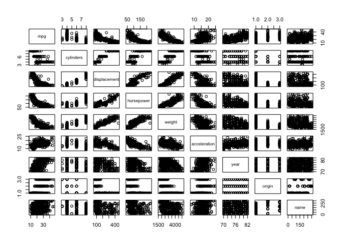

<h1 class="post-subtitle">Conceptual</h1>

### 1.
Each p-value corresponds to the probability that the null hypothesis is true, the null hypothesis being that there is no relationship between the predictor (one of TV, radio or newspaper) and sales given the other two predictors are held constant. *i.e. There is no relationship between TV advertising spend and sales given the advertising spend on radio and newspaper is held constant.*

Given the p-values we can conclude that both TV and radio advertising spend have a relationship to sales while newspaper does not.

### 2.
Simply the difference between classification and regression. Classification involves identifying which category an observation belongs to, regression involves predicting a quantifiable output value.

### 3.
**a)**

Let's construct the entire model so it's easier to look at.

$$ Salary = 50 + 20(GPA) + 0.07(IQ) + 35(Female) + 0.01(GPA)(IQ) - 10(GPA)(Female) $$

The correct answer is  iii. For a fixed value of IQ and GPA, males earn more on average than females provided that the GPA is high enough. Simplify the form of the equation to the following:

$$ Salary = 50 + 20(GPA) + 0.07(IQ) + (Female)(35 - 10(GPA)) + 0.01(GPA)(IQ) $$

We see that only females suffer the negative affect on starting salary due to term $\hat{\beta_5}$ depending on GPA. Let's run a test case between a male and female with GPA 4.0 to prove it though.

Male, GPA 4: $ Salary = 50 + 80 + 0.07(IQ) + 0 + 0.04(IQ) $

Female, GPA 4: $ Salary = 50 + 80 + 0.07(IQ) - 5  + 0.04(IQ) $

Hence, provided GPA is quite high males will earn more on average than females.

**b)**

We can reuse the previous equation luckily!

$$ Salary = 50 + 80 -5 + 0.11(110) = 137.1 * ($1000)$$

**c)**

False. You need to compute the ratio of the coefficient to the standard error associated with the predictor to determine if there is a relationship between the predictor and the output. Despite the coefficient being small, if the standard error is significantly smaller that still indicates strongly that the interaction effect has a relationship to the output.

### 4.

**a)**

The training RSS for the cubic regression will never be larger than the linear regression, it will only be equal to or smaller. This is just a consequence of the mathematics of using least-squares. Consider the respective formulas for the RSS of each regression.

$$ RSS_{linear} = \sum\limits_{i=1}^n (y_i - \beta_0 - \beta_1x_i)^2 $$

$$ RSS_{cubic} = \sum\limits_{i=1}^n (y_i - \beta_0 - \beta_1x_i - \beta_2x_i^2 - \beta_3x_i^3)^2 $$

Least squares picks coefficients which minimise RSS by definition. Now consider the case where $\beta_2, \beta_3$ are non-zero and the training RSS for cubic is worse than linear. This is clearly impossible because the least squares method minimises RSS and the cubic regression can simply be made equivalent to the linear regression by setting $\beta_2 = \beta_3 = 0$. Hence the training RSS of the cubic regression can never be more than the training RSS of the linear regression. This concept can also be extended. The addition of any predictor to an existing regression model will never increase the RSS calculated on the same training set.

**b)**

I would expect the test RSS for the linear regression to be smaller than that of the cubic regression as a simply consequence of it matching the true relationship to a greater degree. It should be noted that this is not deterministic unlike part a, it is possible (though unlikely) for the test RSS of the cubic regression to be smaller.

**c)**

Using the same argument as in part a, the training RSS for the cubic regression will always be smaller.

**d)**

In this case I would expect the test RSS for the cubic regression to be smaller, as a simple consequence of it being able to adapt to some degree of non-linearity. Again this is not deterministic.

### 5.

**a)**

We have

$$ \hat{y_i} = x_i\hat{\beta} $$

$$ \hat{beta} = \frac{\sum\limits_{j=1}^nx_jy_j}{\sum\limits_{k=1}^nx_k^2} $$

Note we're not using the $i$ and $i'$ terminology because it's needlessly confusing in this case.

$$ \hat{y_i} = x_i\frac{\sum\limits_{j=1}^nx_jy_j}{\sum\limits_{k=1}^nx_k^2} $$

Take $x_i$ inside the summation term as it's a constant in this case.

$$ \hat{y_i} = \frac{\sum\limits_{j=1}^nx_ix_jy_j}{\sum\limits_{k=1}^nx_k^2} $$

Take the summation over j over the fraction as the denominator has no relation to it. Take $y_j$ outside the numerator for clarity.

$$ \hat{y_i} = \sum\limits_{j=1}^n\frac{x_ix_j}{\sum\limits_{k=1}^nx_k^2}y_j $$

This is the form we want, therefore:

$$ a_j = \frac{x_ix_j}{\sum\limits_{k=1}^nx_k^2} $$

### 6.

$$ \hat{y_i} = \hat{\beta}_0 + \hat{\beta_1}x_i $$

Substitute in the point ($\overline{x}, \overline{y}$)

$$
\begin{align*}
\overline{y} &= \hat{\beta_0} + \hat{\beta_1}\overline{x} \\
 &= \overline{y} - \hat{\beta_1}\overline{x} + \hat{\beta_1}\overline{x} \\
 &= \overline{y}
\end{align*}
$$

Thereforce the point satisfies the equation, the least squares line in simple regression will always pass through the point.

### 7.

$$ R^2 = \frac{TSS-RSS}{TSS} $$

$$ Cor(X,Y) = \frac{\sum\limits_{i=1}^n x_iy_i}{\sqrt{\sum\limits_{i=1}^n x_i^2} \sqrt{\sum\limits_{i=1}^n y_i^2}} $$

Where $TSS = \sum y_i^2$ and $RSS = \sum(y_i - \hat{y_i})^2$ and assuming $\overline{x} = \overline{y} = 0$.

$$
\begin{align*}
R^2 &= \frac{TSS-RSS}{TSS} \\
&= \frac{\sum\limits_{i=1}^n y_i^2 - \sum\limits_{i=1}^n(y_i - \hat{y_i})^2}{\sum\limits_{i=1}^n y_i^2} \\
&= \frac{\sum\limits_{i=1}^n y_i^2 - (y_i - \hat{y})^2}{\sum\limits_{i=1}^n y_i^2} \\
&= \frac{\sum\limits_{i=1}^n 2\hat{y}y_i - \hat{y}^2}{\sum\limits_{i=1}^n y_i^2}
\end{align*}
$$

Under the assumption that $\overline{y} = \overline{x} = 0$, $\hat{\beta_0} = 0$ and $\hat{\beta_1} = \frac{\sum x_iy_i}{\sum x_i^2}$. Therefore $\hat{y} = \hat{\beta_1}x$. Substituting that in:

$$
\begin{align*}
R^2 &= \frac{\sum\limits_{i=1}^n 2\beta_1x_iy_i - (\hat{\beta_1}x_i)^2}{\sum\limits_{i=1}^n y_i^2} \\
&= \hat{\beta_1}\frac{2\sum\limits_{i=1}^n x_iy_i - \hat{\beta_1}\sum\limits_{i=1}^n x_i^2}{\sum\limits_{i=1}^n y_i^2} \\
&= \hat{\beta_1}\frac{2\sum\limits_{i=1}^n x_iy_i - \frac{\sum x_iy_i}{\sum x_i^2}\sum\limits_{i=1}^n x_i^2}{\sum\limits_{i=1}^n y_i^2} \\
&= \hat{\beta_1}\frac{2\sum\limits_{i=1}^n x_iy_i - \sum\limits_{i=1}^n x_iy_i}{\sum\limits_{i=1}^n y_i^2} \\
&= \hat{\beta_1}\frac{\sum\limits_{i=1}^n x_iy_i}{\sum\limits_{i=1}^n y_i^2}\
&= \frac{\sum x_iy_i}{\sum x_i^2}\frac{\sum\limits_{i=1}^n x_iy_i}{\sum\limits_{i=1}^n y_i^2} \\
&= \frac{(\sum\limits_{i=1}^n x_iy_i)^2}{\sum\limits_{i=1}^n x_i^2 \sum\limits_{i=1}^n y_i^2} = Cor(X, Y)^2\\

\end{align*} 
$$

<br><br>

<h1 class="post-subtitle">Applied</h1>


### 8.

Load the auto data set, let's get rid of the missing values.

``` r
auto = read.csv('../../datasets/auto.csv', header=TRUE, na.strings='?')
auto = na.omit(auto)
```

**a)**

``` r
reg_mpg_hp = lm(mpg~horsepower, data=auto)
summary(reg_mpg_hp)
```

    ## 
    ## Call:
    ## lm(formula = mpg ~ horsepower, data = auto)
    ## 
    ## Residuals:
    ##      Min       1Q   Median       3Q      Max 
    ## -13.5710  -3.2592  -0.3435   2.7630  16.9240 
    ## 
    ## Coefficients:
    ##              Estimate Std. Error t value Pr(>|t|)    
    ## (Intercept) 39.935861   0.717499   55.66   <2e-16 ***
    ## horsepower  -0.157845   0.006446  -24.49   <2e-16 ***
    ## ---
    ## Signif. codes:  0 '***' 0.001 '**' 0.01 '*' 0.05 '.' 0.1 ' ' 1
    ## 
    ## Residual standard error: 4.906 on 390 degrees of freedom
    ## Multiple R-squared:  0.6059, Adjusted R-squared:  0.6049 
    ## F-statistic: 599.7 on 1 and 390 DF,  p-value: < 2.2e-16

**i.** We can safely say there's a relationship between horsepower and mpg due to the small p-value.

**ii.**

So let's look at the RSE compared to the mean value of mpg

``` r
summary(reg_mpg_hp)$sigma / mean(auto$mpg)
```

    ## [1] 0.2092371

This means that there's a ~20.1% error using this model. The *R*<sup>2</sup> factor indicates that 60.5% of the variance in mpg can be explained using horsepower. Both these mean that there's a relatively strong relationship here.

**iii.** Negative, just have to look at the sign of the coefficient.

**iv.**

``` r
predict(reg_mpg_hp, newdata=data.frame(horsepower=98), level=0.95, interval="confidence")
```

    ##        fit      lwr      upr
    ## 1 24.46708 23.97308 24.96108

``` r
predict(reg_mpg_hp, newdata=data.frame(horsepower=98), level=0.95, interval="prediction")
```

    ##        fit     lwr      upr
    ## 1 24.46708 14.8094 34.12476

Where the fit is the prediction and lower and upper define the interval bounds.

**b)**

``` r
plot(auto$horsepower, auto$mpg)
abline(reg_mpg_hp)
```


There's clearly some non-linearity in the relationship between horsepower and mpg, our model is really going to struggle to create accurate predictions because of that particularly at the extreme ends of horsepower.

### 9.

**a)**

``` r
pairs(auto)
```



**b)**

``` r
cor_auto = cor(auto[, 1:8])
cor_auto
```

    ##                     mpg  cylinders displacement horsepower     weight
    ## mpg           1.0000000 -0.7776175   -0.8051269 -0.7784268 -0.8322442
    ## cylinders    -0.7776175  1.0000000    0.9508233  0.8429834  0.8975273
    ## displacement -0.8051269  0.9508233    1.0000000  0.8972570  0.9329944
    ## horsepower   -0.7784268  0.8429834    0.8972570  1.0000000  0.8645377
    ## weight       -0.8322442  0.8975273    0.9329944  0.8645377  1.0000000
    ## acceleration  0.4233285 -0.5046834   -0.5438005 -0.6891955 -0.4168392
    ## year          0.5805410 -0.3456474   -0.3698552 -0.4163615 -0.3091199
    ## origin        0.5652088 -0.5689316   -0.6145351 -0.4551715 -0.5850054
    ##              acceleration       year     origin
    ## mpg             0.4233285  0.5805410  0.5652088
    ## cylinders      -0.5046834 -0.3456474 -0.5689316
    ## displacement   -0.5438005 -0.3698552 -0.6145351
    ## horsepower     -0.6891955 -0.4163615 -0.4551715
    ## weight         -0.4168392 -0.3091199 -0.5850054
    ## acceleration    1.0000000  0.2903161  0.2127458
    ## year            0.2903161  1.0000000  0.1815277
    ## origin          0.2127458  0.1815277  1.0000000

This isn't necessary but looking at a good plot is always nicer than a matrix of numbers.

``` r
library(corrplot) # this isn't a default package, install it if you want it
corrplot(cor_auto)
```


**c)**

``` r
mulreg_mpg = lm(mpg ~ . - name, data=auto)
summary(mulreg_mpg)
```

    ## 
    ## Call:
    ## lm(formula = mpg ~ . - name, data = auto)
    ## 
    ## Residuals:
    ##     Min      1Q  Median      3Q     Max 
    ## -9.5903 -2.1565 -0.1169  1.8690 13.0604 
    ## 
    ## Coefficients:
    ##                Estimate Std. Error t value Pr(>|t|)    
    ## (Intercept)  -17.218435   4.644294  -3.707  0.00024 ***
    ## cylinders     -0.493376   0.323282  -1.526  0.12780    
    ## displacement   0.019896   0.007515   2.647  0.00844 ** 
    ## horsepower    -0.016951   0.013787  -1.230  0.21963    
    ## weight        -0.006474   0.000652  -9.929  < 2e-16 ***
    ## acceleration   0.080576   0.098845   0.815  0.41548    
    ## year           0.750773   0.050973  14.729  < 2e-16 ***
    ## origin         1.426141   0.278136   5.127 4.67e-07 ***
    ## ---
    ## Signif. codes:  0 '***' 0.001 '**' 0.01 '*' 0.05 '.' 0.1 ' ' 1
    ## 
    ## Residual standard error: 3.328 on 384 degrees of freedom
    ## Multiple R-squared:  0.8215, Adjusted R-squared:  0.8182 
    ## F-statistic: 252.4 on 7 and 384 DF,  p-value: < 2.2e-16

**i.**

Yes, so we're doing a multiple linear regression now so we're interested in look at the F-statistic and it's associated p-value to reject the null hypothesis. The p-value is tiny so we can safely say there is a relationship between at least some of the predictors and the response.

**ii.**

Weight, year, origin and displacement based on their respective p-values. We've discovered that horsepower isn't actually all that significant here, which actually makes sense as it's clearly going to be correlated with other variables like weight and displacement.

**iii.**

It's positive so it suggests that mpg improves over time, which is good news for the environment.

**d)**

``` r
par(mfrow=c(2,2))
plot(mulreg_mpg)
```

 There's a clear trend in the residuals vs the predicted values which indicates there's a degree of non-linearity that our model is not capturing. The normal Q-Q plot reflects this, if the residuals follow a normal distribution (which would be desired) the points fall on the straight line. Here we see the points deviate on the upper end of the plot indicating that are residuals are not normally distributed. We can see a point with particularly high leverage (14) as well as a few outliers, though the outliers don't have significant leverage so their impact on the model isn't that significant.

**e)**

We can use a bit of intuition to guess some significant interaction effects. For example I think horsepower and weight would have an interaction effect, as horsepower increases the impact of weight on MPG will multiply. Let's check it.

``` r
lm.fit = lm(mpg ~ . -name +horsepower:weight, data=auto)
summary(lm.fit)
```

    ## 
    ## Call:
    ## lm(formula = mpg ~ . - name + horsepower:weight, data = auto)
    ## 
    ## Residuals:
    ##    Min     1Q Median     3Q    Max 
    ## -8.589 -1.617 -0.184  1.541 12.001 
    ## 
    ## Coefficients:
    ##                     Estimate Std. Error t value Pr(>|t|)    
    ## (Intercept)        2.876e+00  4.511e+00   0.638 0.524147    
    ## cylinders         -2.955e-02  2.881e-01  -0.103 0.918363    
    ## displacement       5.950e-03  6.750e-03   0.881 0.378610    
    ## horsepower        -2.313e-01  2.363e-02  -9.791  < 2e-16 ***
    ## weight            -1.121e-02  7.285e-04 -15.393  < 2e-16 ***
    ## acceleration      -9.019e-02  8.855e-02  -1.019 0.309081    
    ## year               7.695e-01  4.494e-02  17.124  < 2e-16 ***
    ## origin             8.344e-01  2.513e-01   3.320 0.000986 ***
    ## horsepower:weight  5.529e-05  5.227e-06  10.577  < 2e-16 ***
    ## ---
    ## Signif. codes:  0 '***' 0.001 '**' 0.01 '*' 0.05 '.' 0.1 ' ' 1
    ## 
    ## Residual standard error: 2.931 on 383 degrees of freedom
    ## Multiple R-squared:  0.8618, Adjusted R-squared:  0.859 
    ## F-statistic: 298.6 on 8 and 383 DF,  p-value: < 2.2e-16

Looks like the hunch was correct, that low p-value means the horsepower:weight interaction effect has statistical significance. We should also take note that cylinders and displacement don't have significance in this model anymore which isn't logically surprising, those two values are clearly related to horsepower and weight. Let's drop them from the model along with acceleration.

``` r
lm.fit = lm(mpg ~ . -name -cylinders -acceleration -displacement +horsepower:weight, data=auto)
summary(lm.fit)
```

    ## 
    ## Call:
    ## lm(formula = mpg ~ . - name - cylinders - acceleration - displacement + 
    ##     horsepower:weight, data = auto)
    ## 
    ## Residuals:
    ##     Min      1Q  Median      3Q     Max 
    ## -8.6051 -1.7722 -0.1304  1.5205 12.0369 
    ## 
    ## Coefficients:
    ##                     Estimate Std. Error t value Pr(>|t|)    
    ## (Intercept)        8.145e-01  3.969e+00   0.205  0.83753    
    ## horsepower        -2.160e-01  2.055e-02 -10.514  < 2e-16 ***
    ## weight            -1.106e-02  6.343e-04 -17.435  < 2e-16 ***
    ## year               7.677e-01  4.464e-02  17.195  < 2e-16 ***
    ## origin             7.224e-01  2.328e-01   3.103  0.00206 ** 
    ## horsepower:weight  5.501e-05  5.051e-06  10.891  < 2e-16 ***
    ## ---
    ## Signif. codes:  0 '***' 0.001 '**' 0.01 '*' 0.05 '.' 0.1 ' ' 1
    ## 
    ## Residual standard error: 2.931 on 386 degrees of freedom
    ## Multiple R-squared:  0.8608, Adjusted R-squared:  0.859 
    ## F-statistic: 477.5 on 5 and 386 DF,  p-value: < 2.2e-16

We haven't suffered any loss in accuracy of the model though with less non-statistically significant predictors our F-statistic has increased significantly. Let's check if there's an interaction effect between weight and year now, my hunch is that increasing weight will have a much less significant impact on newer cars than lower cars.

``` r
lm.fit = lm(mpg ~ . -name -cylinders -acceleration -displacement +horsepower:weight + weight:year, data=auto)
summary(lm.fit)
```

    ## 
    ## Call:
    ## lm(formula = mpg ~ . - name - cylinders - acceleration - displacement + 
    ##     horsepower:weight + weight:year, data = auto)
    ## 
    ## Residuals:
    ##     Min      1Q  Median      3Q     Max 
    ## -8.1726 -1.6733 -0.1009  1.3584 11.6095 
    ## 
    ## Coefficients:
    ##                     Estimate Std. Error t value Pr(>|t|)    
    ## (Intercept)       -5.307e+01  1.438e+01  -3.690 0.000257 ***
    ## horsepower        -1.871e-01  2.151e-02  -8.701  < 2e-16 ***
    ## weight             8.861e-03  5.156e-03   1.719 0.086502 .  
    ## year               1.440e+00  1.782e-01   8.079 8.49e-15 ***
    ## origin             7.159e-01  2.287e-01   3.131 0.001876 ** 
    ## horsepower:weight  4.446e-05  5.653e-06   7.865 3.76e-14 ***
    ## weight:year       -2.484e-04  6.381e-05  -3.892 0.000117 ***
    ## ---
    ## Signif. codes:  0 '***' 0.001 '**' 0.01 '*' 0.05 '.' 0.1 ' ' 1
    ## 
    ## Residual standard error: 2.878 on 385 degrees of freedom
    ## Multiple R-squared:  0.8661, Adjusted R-squared:  0.864 
    ## F-statistic:   415 on 6 and 385 DF,  p-value: < 2.2e-16

Looks like a slight improvement on the model. Some further testing got me here:

``` r
lm.fit = lm(mpg ~ origin +displacement*horsepower +displacement*weight +weight*year, data=auto)
summary(lm.fit)
```

    ## 
    ## Call:
    ## lm(formula = mpg ~ origin + displacement * horsepower + displacement * 
    ##     weight + weight * year, data = auto)
    ## 
    ## Residuals:
    ##    Min     1Q Median     3Q    Max 
    ## -8.704 -1.544 -0.029  1.293 12.049 
    ## 
    ## Coefficients:
    ##                           Estimate Std. Error t value Pr(>|t|)    
    ## (Intercept)             -5.961e+01  1.346e+01  -4.429 1.24e-05 ***
    ## origin                   6.386e-01  2.482e-01   2.573  0.01047 *  
    ## displacement            -5.525e-02  9.210e-03  -5.999 4.61e-09 ***
    ## horsepower              -1.073e-01  2.085e-02  -5.147 4.24e-07 ***
    ## weight                   1.311e-02  4.774e-03   2.747  0.00630 ** 
    ## year                     1.481e+00  1.715e-01   8.631  < 2e-16 ***
    ## displacement:horsepower  2.222e-04  6.853e-05   3.243  0.00129 ** 
    ## displacement:weight      9.884e-06  3.415e-06   2.895  0.00401 ** 
    ## weight:year             -2.636e-04  6.104e-05  -4.319 2.00e-05 ***
    ## ---
    ## Signif. codes:  0 '***' 0.001 '**' 0.01 '*' 0.05 '.' 0.1 ' ' 1
    ## 
    ## Residual standard error: 2.838 on 383 degrees of freedom
    ## Multiple R-squared:  0.8705, Adjusted R-squared:  0.8678 
    ## F-statistic: 321.8 on 8 and 383 DF,  p-value: < 2.2e-16

And let's plot the residuals for this model.

``` r
par(mfrow=c(2,2))
plot(lm.fit)
```


Definitely better than before but still could use some improvement.

**f)**

``` r
lm.fit = lm(mpg ~ origin +I(weight^2) +displacement*horsepower +displacement:weight +weight*year, data=auto)
summary(lm.fit)
```

    ## 
    ## Call:
    ## lm(formula = mpg ~ origin + I(weight^2) + displacement * horsepower + 
    ##     displacement:weight + weight * year, data = auto)
    ## 
    ## Residuals:
    ##     Min      1Q  Median      3Q     Max 
    ## -8.5416 -1.5948 -0.0548  1.2907 11.9759 
    ## 
    ## Coefficients:
    ##                           Estimate Std. Error t value Pr(>|t|)    
    ## (Intercept)             -5.598e+01  1.425e+01  -3.928 0.000102 ***
    ## origin                   6.549e-01  2.492e-01   2.628 0.008940 ** 
    ## I(weight^2)              5.522e-07  7.099e-07   0.778 0.437119    
    ## displacement            -3.915e-02  2.265e-02  -1.728 0.084745 .  
    ## horsepower              -1.095e-01  2.105e-02  -5.202 3.22e-07 ***
    ## weight                   1.007e-02  6.172e-03   1.632 0.103505    
    ## year                     1.461e+00  1.734e-01   8.426 7.39e-16 ***
    ## displacement:horsepower  2.384e-04  7.165e-05   3.327 0.000962 ***
    ## displacement:weight      4.389e-06  7.847e-06   0.559 0.576267    
    ## weight:year             -2.551e-04  6.205e-05  -4.111 4.83e-05 ***
    ## ---
    ## Signif. codes:  0 '***' 0.001 '**' 0.01 '*' 0.05 '.' 0.1 ' ' 1
    ## 
    ## Residual standard error: 2.839 on 382 degrees of freedom
    ## Multiple R-squared:  0.8707, Adjusted R-squared:  0.8677 
    ## F-statistic: 285.9 on 9 and 382 DF,  p-value: < 2.2e-16

Well using a square factor on weight made the model worse.

``` r
lm.fit = lm(mpg ~ origin +sqrt(displacement) +weight +displacement:horsepower +displacement:weight +weight*year, data=auto)
summary(lm.fit)
```

    ## 
    ## Call:
    ## lm(formula = mpg ~ origin + sqrt(displacement) + weight + displacement:horsepower + 
    ##     displacement:weight + weight * year, data = auto)
    ## 
    ## Residuals:
    ##      Min       1Q   Median       3Q      Max 
    ## -10.2072  -1.5781  -0.0619   1.4002  11.9883 
    ## 
    ## Coefficients:
    ##                           Estimate Std. Error t value Pr(>|t|)    
    ## (Intercept)             -6.472e+01  1.393e+01  -4.646 4.65e-06 ***
    ## origin                   3.906e-01  2.576e-01   1.516 0.130249    
    ## sqrt(displacement)      -1.189e+00  2.005e-01  -5.928 6.83e-09 ***
    ## weight                   1.322e-02  4.799e-03   2.754 0.006161 ** 
    ## year                     1.622e+00  1.736e-01   9.343  < 2e-16 ***
    ## displacement:horsepower -1.096e-04  3.157e-05  -3.472 0.000575 ***
    ## weight:displacement      1.710e-05  2.327e-06   7.350 1.20e-12 ***
    ## weight:year             -3.006e-04  6.202e-05  -4.847 1.82e-06 ***
    ## ---
    ## Signif. codes:  0 '***' 0.001 '**' 0.01 '*' 0.05 '.' 0.1 ' ' 1
    ## 
    ## Residual standard error: 2.924 on 384 degrees of freedom
    ## Multiple R-squared:  0.8621, Adjusted R-squared:  0.8596 
    ## F-statistic:   343 on 7 and 384 DF,  p-value: < 2.2e-16

Same with using a square root on displacement.

``` r
lm.fit = lm(log(mpg) ~ origin +displacement*horsepower +displacement*weight +weight*year, data=auto)
summary(lm.fit)
```

    ## 
    ## Call:
    ## lm(formula = log(mpg) ~ origin + displacement * horsepower + 
    ##     displacement * weight + weight * year, data = auto)
    ## 
    ## Residuals:
    ##      Min       1Q   Median       3Q      Max 
    ## -0.38175 -0.06824 -0.00173  0.05964  0.40893 
    ## 
    ## Coefficients:
    ##                           Estimate Std. Error t value Pr(>|t|)    
    ## (Intercept)              1.852e+00  5.298e-01   3.496 0.000527 ***
    ## origin                   1.909e-02  9.772e-03   1.954 0.051469 .  
    ## displacement            -1.812e-03  3.626e-04  -4.997 8.86e-07 ***
    ## horsepower              -4.110e-03  8.210e-04  -5.006 8.51e-07 ***
    ## weight                  -2.106e-04  1.879e-04  -1.120 0.263213    
    ## year                     3.182e-02  6.753e-03   4.712 3.44e-06 ***
    ## displacement:horsepower  8.715e-06  2.698e-06   3.230 0.001343 ** 
    ## displacement:weight      2.289e-07  1.344e-07   1.703 0.089448 .  
    ## weight:year             -6.796e-07  2.403e-06  -0.283 0.777496    
    ## ---
    ## Signif. codes:  0 '***' 0.001 '**' 0.01 '*' 0.05 '.' 0.1 ' ' 1
    ## 
    ## Residual standard error: 0.1117 on 383 degrees of freedom
    ## Multiple R-squared:  0.8943, Adjusted R-squared:  0.892 
    ## F-statistic: 404.9 on 8 and 383 DF,  p-value: < 2.2e-16

Interestingly using a log(mpg) fit has made the model fit the training data notably better, let's plot the residuals out.

``` r
par(mfrow=c(2,2))
plot(lm.fit)
```


The residuals are looking quite a lot better now, indicating that our model has accounted for a fair bit of the non-linearity in the relationships. It should be noted that we could be over fitting the model, unfortunately there's no test data.

### 10.

``` r
library(ISLR)
```

**a)**

``` r
mulreg_price = lm(Sales ~ Price + Urban + US, data=Carseats)
summary(mulreg_price)
```

    ## 
    ## Call:
    ## lm(formula = Sales ~ Price + Urban + US, data = Carseats)
    ## 
    ## Residuals:
    ##     Min      1Q  Median      3Q     Max 
    ## -6.9206 -1.6220 -0.0564  1.5786  7.0581 
    ## 
    ## Coefficients:
    ##              Estimate Std. Error t value Pr(>|t|)    
    ## (Intercept) 13.043469   0.651012  20.036  < 2e-16 ***
    ## Price       -0.054459   0.005242 -10.389  < 2e-16 ***
    ## UrbanYes    -0.021916   0.271650  -0.081    0.936    
    ## USYes        1.200573   0.259042   4.635 4.86e-06 ***
    ## ---
    ## Signif. codes:  0 '***' 0.001 '**' 0.01 '*' 0.05 '.' 0.1 ' ' 1
    ## 
    ## Residual standard error: 2.472 on 396 degrees of freedom
    ## Multiple R-squared:  0.2393, Adjusted R-squared:  0.2335 
    ## F-statistic: 41.52 on 3 and 396 DF,  p-value: < 2.2e-16

**b)**

Higher prices lead to less sales, stores in the US sell more car seats than those which are not. Whether the store is an an urban location is statistically insignificant.

**c)**

$$ Sales = \hat{\beta_0} + \hat{\beta_1}Price + \hat{\beta_2}isUrban + \hat{\beta_3}inUS $$
 Where $\hat{\beta_0} = 13.043469, \hat{\beta_1} = -0.05449, \hat{\beta_2} = -0.021916, \hat{\beta_3} = 1.200573$.

**d)**

For Price and USYes.

**e)**

``` r
mulreg_price = lm(Sales ~ Price + US, data=Carseats)
summary(mulreg_price)
```

    ## 
    ## Call:
    ## lm(formula = Sales ~ Price + US, data = Carseats)
    ## 
    ## Residuals:
    ##     Min      1Q  Median      3Q     Max 
    ## -6.9269 -1.6286 -0.0574  1.5766  7.0515 
    ## 
    ## Coefficients:
    ##             Estimate Std. Error t value Pr(>|t|)    
    ## (Intercept) 13.03079    0.63098  20.652  < 2e-16 ***
    ## Price       -0.05448    0.00523 -10.416  < 2e-16 ***
    ## USYes        1.19964    0.25846   4.641 4.71e-06 ***
    ## ---
    ## Signif. codes:  0 '***' 0.001 '**' 0.01 '*' 0.05 '.' 0.1 ' ' 1
    ## 
    ## Residual standard error: 2.469 on 397 degrees of freedom
    ## Multiple R-squared:  0.2393, Adjusted R-squared:  0.2354 
    ## F-statistic: 62.43 on 2 and 397 DF,  p-value: < 2.2e-16

**f)**

The both fit poorly, only ~23.5% of the variance in sales is explained using both respective models.

**g)**

``` r
confint(mulreg_price, level=0.95)
```

    ##                   2.5 %      97.5 %
    ## (Intercept) 11.79032020 14.27126531
    ## Price       -0.06475984 -0.04419543
    ## USYes        0.69151957  1.70776632

**h)**

``` r
par(mfrow=c(2,2))
plot(mulreg_price)
```


No outliers as residuals fall within +-3. Compute the average leverage statistic, remembering that $\overline{h} = \frac{p+1}{n}$.

``` r
(2+1)/nrow(Carseats)
```

    ## [1] 0.0075

We can see that there are a few leverage points which are significantly higher than the mean.

### 11.

``` r
set.seed(1)
x=rnorm(100)
y=2*x+rnorm(100)
```

**a)**

``` r
lm.fit = lm(y ~ x + 0)
summary(lm.fit)
```

    ## 
    ## Call:
    ## lm(formula = y ~ x + 0)
    ## 
    ## Residuals:
    ##     Min      1Q  Median      3Q     Max 
    ## -1.9154 -0.6472 -0.1771  0.5056  2.3109 
    ## 
    ## Coefficients:
    ##   Estimate Std. Error t value Pr(>|t|)    
    ## x   1.9939     0.1065   18.73   <2e-16 ***
    ## ---
    ## Signif. codes:  0 '***' 0.001 '**' 0.01 '*' 0.05 '.' 0.1 ' ' 1
    ## 
    ## Residual standard error: 0.9586 on 99 degrees of freedom
    ## Multiple R-squared:  0.7798, Adjusted R-squared:  0.7776 
    ## F-statistic: 350.7 on 1 and 99 DF,  p-value: < 2.2e-16

The coefficient is extremely close to the true value, the null hypothesis has clearly been rejected given the p-value.

**b)**

``` r
lm.fit = lm(x ~ y + 0)
summary(lm.fit)
```

    ## 
    ## Call:
    ## lm(formula = x ~ y + 0)
    ## 
    ## Residuals:
    ##     Min      1Q  Median      3Q     Max 
    ## -0.8699 -0.2368  0.1030  0.2858  0.8938 
    ## 
    ## Coefficients:
    ##   Estimate Std. Error t value Pr(>|t|)    
    ## y  0.39111    0.02089   18.73   <2e-16 ***
    ## ---
    ## Signif. codes:  0 '***' 0.001 '**' 0.01 '*' 0.05 '.' 0.1 ' ' 1
    ## 
    ## Residual standard error: 0.4246 on 99 degrees of freedom
    ## Multiple R-squared:  0.7798, Adjusted R-squared:  0.7776 
    ## F-statistic: 350.7 on 1 and 99 DF,  p-value: < 2.2e-16

Given the truth would be $x = \frac{1}{2}y$ the coefficient is further off. Though interestingly the t-value and hence corresponding p-value and *R*<sup>2</sup> statistics are identical. This makes conceptual sense given that it should represent how much variance in the output the predictor can account for which, given there is only one predictor, is logically invertible.

**c)**

Already explained this.

**d)**

$$\hat{\beta} = \frac{\sum x_iy_i}{\sum x_i^2}$$

$$SE(\hat{\beta}) = \frac{\sum{(y_i - x_i\hat{\beta})^2}}{(n-1)\sum x_i^2}$$

$$
\begin{align*}
t &= \frac{\hat{\beta}}{SE(\hat{\beta})} \\
&= \frac{\sum x_iy_i}{\sum x_i^2} \times \frac{\sqrt{n-1}\sqrt{\sum x_i^2}}{\sqrt{\sum (y_i - x_i\hat{\beta})^2}} \\
&= \frac{\sqrt{n-1}\sum x_iy_i}{\sqrt{\sum x_i^2 \sum(y_i - x_i\hat{\beta})^2}} \\
&= \frac{\sqrt{n-1}\sum x_iy_i}{\sqrt{\sum x_i^2 \sum (y_i^2 -2\hat{\beta}x_iy_i + \hat{\beta}^2x_i^2)}} \\
&= \frac{\sqrt{n-1}\sum x_iy_i}{\sqrt{\sum x_i^2 \sum (y_i^2 -2\frac{\sum x_iy_i}{\sum x_i^2}x_iy_i + (\frac{\sum x_iy_i}{\sum x_i^2})^2x_i^2)}} \\
&= \frac{\sqrt{n-1}\sum x_iy_i}{\sqrt{\sum x_i^2 \sum y_i^2 - (\sum x_iy_i)^2}}
\end{align*}
$$

 Verify in R.

``` r
n = length(x)
sqrt(n-1)*sum(x*y) / sqrt(sum(x^2)*sum(y^2) - (sum(x*y))^2)
```

    ## [1] 18.72593

**e)**

Simply put, it's trivial to see that by setting y=x, and x=y, that the resulting t equation is the same.

**f)**

``` r
lm.fit = lm(y~x)
coef(summary(lm.fit))[, "t value"]
```

    ## (Intercept)           x 
    ##  -0.3886346  18.5555993

``` r
lm.fit = lm(x~y)
coef(summary(lm.fit))[, "t value"]
```

    ## (Intercept)           y 
    ##   0.9095787  18.5555993

### 12.

**a)**

When ∑*x*<sub>*i*</sub><sup>2</sup> = ∑*y*<sub>*i*</sub><sup>2</sup>.

**b)**

``` r
set.seed(13)
x = rnorm(100)
y = 4*x + rnorm(100)
lm.fit = lm(y~x)
summary(lm.fit)
```

    ## 
    ## Call:
    ## lm(formula = y ~ x)
    ## 
    ## Residuals:
    ##      Min       1Q   Median       3Q      Max 
    ## -2.85767 -0.78824 -0.04293  0.65047  2.78808 
    ## 
    ## Coefficients:
    ##             Estimate Std. Error t value Pr(>|t|)    
    ## (Intercept)  0.02803    0.10980   0.255    0.799    
    ## x            3.94461    0.11581  34.061   <2e-16 ***
    ## ---
    ## Signif. codes:  0 '***' 0.001 '**' 0.01 '*' 0.05 '.' 0.1 ' ' 1
    ## 
    ## Residual standard error: 1.096 on 98 degrees of freedom
    ## Multiple R-squared:  0.9221, Adjusted R-squared:  0.9213 
    ## F-statistic:  1160 on 1 and 98 DF,  p-value: < 2.2e-16

``` r
lm.fit = lm(x~y)
summary(lm.fit)
```

    ## 
    ## Call:
    ## lm(formula = x ~ y)
    ## 
    ## Residuals:
    ##      Min       1Q   Median       3Q      Max 
    ## -0.77047 -0.15212 -0.00718  0.15567  0.69411 
    ## 
    ## Coefficients:
    ##              Estimate Std. Error t value Pr(>|t|)    
    ## (Intercept) -0.011369   0.026713  -0.426    0.671    
    ## y            0.233765   0.006863  34.061   <2e-16 ***
    ## ---
    ## Signif. codes:  0 '***' 0.001 '**' 0.01 '*' 0.05 '.' 0.1 ' ' 1
    ## 
    ## Residual standard error: 0.2667 on 98 degrees of freedom
    ## Multiple R-squared:  0.9221, Adjusted R-squared:  0.9213 
    ## F-statistic:  1160 on 1 and 98 DF,  p-value: < 2.2e-16

As required.

**c)**

``` r
set.seed(13)
x = rnorm(100)
y = sample(x) # This just reorders x, you'll still get the same elements
lm.fit = lm(y~x)
summary(lm.fit)
```

    ## 
    ## Call:
    ## lm(formula = y ~ x)
    ## 
    ## Residuals:
    ##      Min       1Q   Median       3Q      Max 
    ## -1.95959 -0.68800 -0.01691  0.62604  1.89303 
    ## 
    ## Coefficients:
    ##              Estimate Std. Error t value Pr(>|t|)
    ## (Intercept) -0.061488   0.095770  -0.642    0.522
    ## x            0.005454   0.101014   0.054    0.957
    ## 
    ## Residual standard error: 0.9557 on 98 degrees of freedom
    ## Multiple R-squared:  2.974e-05,  Adjusted R-squared:  -0.01017 
    ## F-statistic: 0.002915 on 1 and 98 DF,  p-value: 0.9571

``` r
lm.fit = lm(x~y)
summary(lm.fit)
```

    ## 
    ## Call:
    ## lm(formula = x ~ y)
    ## 
    ## Residuals:
    ##      Min       1Q   Median       3Q      Max 
    ## -1.97103 -0.69776 -0.02168  0.62144  1.89905 
    ## 
    ## Coefficients:
    ##              Estimate Std. Error t value Pr(>|t|)
    ## (Intercept) -0.061488   0.095770  -0.642    0.522
    ## y            0.005454   0.101014   0.054    0.957
    ## 
    ## Residual standard error: 0.9557 on 98 degrees of freedom
    ## Multiple R-squared:  2.974e-05,  Adjusted R-squared:  -0.01017 
    ## F-statistic: 0.002915 on 1 and 98 DF,  p-value: 0.9571

As required.

### 13.

``` r
set.seed(1)
```

**a)**

``` r
x = rnorm(100)
```

**b)**

``` r
eps = rnorm(100, mean=0, sd=sqrt(0.25))
```

**c)**

``` r
y = -1 + 0.5*x + eps
```

Length of y is 100, $\hat{\beta_0} = -1, \hat{\beta_1} = 0.5$.

**d)**

``` r
plot(x, y)
```

 

A generally linear trend.

**e)**

``` r
lm.fit = lm(y~x)
summary(lm.fit)
```

    ## 
    ## Call:
    ## lm(formula = y ~ x)
    ## 
    ## Residuals:
    ##      Min       1Q   Median       3Q      Max 
    ## -0.93842 -0.30688 -0.06975  0.26970  1.17309 
    ## 
    ## Coefficients:
    ##             Estimate Std. Error t value Pr(>|t|)    
    ## (Intercept) -1.01885    0.04849 -21.010  < 2e-16 ***
    ## x            0.49947    0.05386   9.273 4.58e-15 ***
    ## ---
    ## Signif. codes:  0 '***' 0.001 '**' 0.01 '*' 0.05 '.' 0.1 ' ' 1
    ## 
    ## Residual standard error: 0.4814 on 98 degrees of freedom
    ## Multiple R-squared:  0.4674, Adjusted R-squared:  0.4619 
    ## F-statistic: 85.99 on 1 and 98 DF,  p-value: 4.583e-15

The estimates of both coefficients are very close to their true values.

**f)**

``` r
plot(x, y)
abline(lm.fit, col=2)
abline(-1, 0.5, col=3)
legend(-1, legend = c("least squares", "pop. regression"), col=2:3, lwd=3)
```


**g)**

``` r
lm.fitq = lm(y ~ x + I(x^2))
summary(lm.fitq)
```

    ## 
    ## Call:
    ## lm(formula = y ~ x + I(x^2))
    ## 
    ## Residuals:
    ##      Min       1Q   Median       3Q      Max 
    ## -0.98252 -0.31270 -0.06441  0.29014  1.13500 
    ## 
    ## Coefficients:
    ##             Estimate Std. Error t value Pr(>|t|)    
    ## (Intercept) -0.97164    0.05883 -16.517  < 2e-16 ***
    ## x            0.50858    0.05399   9.420  2.4e-15 ***
    ## I(x^2)      -0.05946    0.04238  -1.403    0.164    
    ## ---
    ## Signif. codes:  0 '***' 0.001 '**' 0.01 '*' 0.05 '.' 0.1 ' ' 1
    ## 
    ## Residual standard error: 0.479 on 97 degrees of freedom
    ## Multiple R-squared:  0.4779, Adjusted R-squared:  0.4672 
    ## F-statistic:  44.4 on 2 and 97 DF,  p-value: 2.038e-14

No. The p-value of the quadratic term deems it statistically insignfiicant and there's been a reduction in the adjusted *R*<sup>2</sup> factor.

**h)**

``` r
x = rnorm(100)
eps = rnorm(100, mean=0, sd=sqrt(0.1))
y = -1 + 0.5*x + eps

lm.fit2 = lm(y ~ x)
summary(lm.fit2)
```

    ## 
    ## Call:
    ## lm(formula = y ~ x)
    ## 
    ## Residuals:
    ##      Min       1Q   Median       3Q      Max 
    ## -0.86703 -0.17753 -0.00553  0.21495  0.58452 
    ## 
    ## Coefficients:
    ##             Estimate Std. Error t value Pr(>|t|)    
    ## (Intercept) -0.98468    0.03134  -31.42   <2e-16 ***
    ## x            0.53359    0.03044   17.53   <2e-16 ***
    ## ---
    ## Signif. codes:  0 '***' 0.001 '**' 0.01 '*' 0.05 '.' 0.1 ' ' 1
    ## 
    ## Residual standard error: 0.3133 on 98 degrees of freedom
    ## Multiple R-squared:  0.7582, Adjusted R-squared:  0.7557 
    ## F-statistic: 307.3 on 1 and 98 DF,  p-value: < 2.2e-16

``` r
plot(x, y)
abline(lm.fit2, col=2)
abline(-1, 0.5, col=3)
legend(-1, legend = c("linear fit", "pop. regression"), col=2:3, lwd=3)
```


The reduction in noise has caused the *R*<sup>2</sup> factor to increase as expected.

**i)**

``` r
x = rnorm(100)
eps = rnorm(100, mean=0, sd=sqrt(0.5))
y = -1 + 0.5*x + eps

lm.fit3 = lm(y ~ x)
summary(lm.fit3)
```

    ## 
    ## Call:
    ## lm(formula = y ~ x)
    ## 
    ## Residuals:
    ##     Min      1Q  Median      3Q     Max 
    ## -1.7749 -0.4281  0.0146  0.4984  1.4777 
    ## 
    ## Coefficients:
    ##             Estimate Std. Error t value Pr(>|t|)    
    ## (Intercept) -1.03355    0.06842 -15.105  < 2e-16 ***
    ## x            0.44700    0.05876   7.607 1.73e-11 ***
    ## ---
    ## Signif. codes:  0 '***' 0.001 '**' 0.01 '*' 0.05 '.' 0.1 ' ' 1
    ## 
    ## Residual standard error: 0.6838 on 98 degrees of freedom
    ## Multiple R-squared:  0.3713, Adjusted R-squared:  0.3648 
    ## F-statistic: 57.87 on 1 and 98 DF,  p-value: 1.731e-11

``` r
plot(x, y)
abline(lm.fit3, col=2)
abline(-1, 0.5, col=3)
legend(-1, legend = c("linear fit", "pop. regression"), col=2:3, lwd=3)
```

 

The fit is much worse as can be seen, the *R*<sup>2</sup> factor is correspondingly much lower.

**j)**

``` r
confint(lm.fit)
```

    ##                  2.5 %     97.5 %
    ## (Intercept) -1.1150804 -0.9226122
    ## x            0.3925794  0.6063602

``` r
confint(lm.fit2)
```

    ##                  2.5 %     97.5 %
    ## (Intercept) -1.0468683 -0.9224893
    ## x            0.4731823  0.5939962

``` r
confint(lm.fit3)
```

    ##                  2.5 %     97.5 %
    ## (Intercept) -1.1693360 -0.8977719
    ## x            0.3303927  0.5636136

The least noisy set has the narrowest interval, and the noisiest set has the largest interval. As would be expected.


