<h1 class="post-subtitle">Conceptual</h1>

### 1.

Let $A = e^{\beta_0 + \beta_1X}$ and $P = p(X)$.

$$
\begin{align*}
P &= \frac{A}{1+A} \\
P(1+A) &= A \\
P + PA &= A \\
&= A - PA \\
&= A(1 - P) \\
\therefore A &= \frac{P}{1 - P}
\end{align*}
$$

### 2.

$$
\begin{align*}
p_k(x) = \frac{\pi_k\frac{1}{\sqrt{2\pi}\sigma}\exp(-\frac{1}{2\sigma^2}(x-\mu_k)^2)}{\sum \pi_l\frac{1}{\sqrt{2\pi}\sigma}\exp(-\frac{1}{2\sigma^2}(x-\mu_l)^2)}
\end{align*}
$$

Observe that the denominator is a constant, it's not dependent on the index k in any way. Furthermore $\pi_l$, $\sigma$ and $\exp(z)$ are always $> 0$. Hence it's a positive constant which we'll denote as $c$ onwards.

$$
\begin{align*}
p_k(x) &= \frac{\pi_k\frac{1}{\sqrt{2\pi}\sigma}\exp(-\frac{1}{2\sigma^2}(x-\mu_k)^2)}{c} \\
log(p_k(x)) &= log(\frac{\pi_k\frac{1}{\sqrt{2\pi}\sigma}\exp(-\frac{1}{2\sigma^2}(x-\mu_k)^2)}{c}) \\
&= log(\pi_k\frac{1}{\sqrt{2\pi}\sigma}\exp(-\frac{1}{2\sigma^2}(x-\mu_k)^2)) - log(c) \\
&= log(\frac{\pi_k}{\sqrt{2\pi}\sigma}) - \frac{1}{2\sigma^2}(x-\mu_k)^2 - log(c) \\
&= log(\pi_k) - log(\sqrt{2\pi}\sigma) - \frac{x^2}{2\sigma^2} + \frac{\mu_kx}{\sigma^2} - \frac{\mu_k^2}{2\sigma^2} - log(c)
\end{align*}
$$

Now notice that there are two terms in this expression that are not reliant on k, $log(\sqrt{2\pi}\sigma)$ and $\frac{x^2}{2\sigma^2}$. These can then be deemed constants and easily lumped in with a new constant term we'll call $log(c')$, an important note to make is that $\sqrt{2\pi}\sigma$ and $\exp(\frac{x^2}{2\sigma^2})$ are both positive terms so $c'$ is still a strictly positive constant.

$$
\begin{align*}
log(p_k(x)) &= x\frac{\mu_k}{\sigma^2} - \frac{\mu_k^2}{2\sigma^2} + log(\pi_k) - log(c') \\
log(p_k(x)) + log(c') &= x\frac{\mu_k}{\sigma^2} - \frac{\mu_k^2}{2\sigma^2} + log(\pi_k) \\
log(c'p_k(x)) &= \delta_k(x)
\end{align*}
$$

Where $c'$ is strictly positive and the log function is monotonically increasing, hence maximising $\delta_k(x)$ maximises $p_k(x)$ as required.

### 3.

So this question is very wordy but really easy to answer given the proof we did in the previous question. Recall that we only eliminated the quadratic term $\frac{x^2}{2\sigma^2}$ because it had no reliance on k. But in the case of QDA the covariance matrix (which simplifies down to variance for a single predictor) is class specific, thus the terms will be $\frac{x^2}{2\sigma_k^2}$ and it cannot be eliminated as a constant. So the new discriminant will be a quadratic in terms of $x$.

### 4.

**a)**

10%, ignoring the edge cases at $X < 0.05$ and $ X > 0.95$.

**b)**

1%

**c)**

$0.1^{100}$

**d)**

We can see that when p is large and n is relatively small we're only using an extremely small subset of overall data to determine the classification of an observation. Or more accurately as in KNN a fixed amount of points are always used to determine classification, these points will not lie 'closely' to the observation and hence cause a poor fit.

**e)**

Shortcut, the side of the hypercube will always be equal to $s = 0.1^{1/p}$.

So assuming a fixed range of [0, 1] for each predictor and a uniform distribution means points are distributed evenly over the hypervolume. We want a hypervolume that corresponds to 10% of the total hypervolume of the cube which will always be 1, thus $V_{class} = S_{class}^p = 0.1$.

### 5.

**a)**

Expect QDA to perform better on the training data as it will overfit, expect LDA to perform better on the test data as it represents the underlying truth more accurately.

**b)**

Expect QDA to perform better on both.

**c)**

QDA performance will relatively improve with more observations, as is the general case for models with higher flexibility.

**d)**

False. QDA will model the noise present in the system given the extra quadratic term and thus have a higher test error rate.

### 6.

**a)**

$$
\begin{align*}
p(x) &= \frac{e^{\beta_0 + \beta_1x_1 + \beta_2x_2}}{1 + e^{\beta_0 + \beta_1x_1 + \beta_2x_2}} \\
&= \frac{0.61}{1 + 0.61} \\
&= 38\%
\end{align*}
$$

**b)**

$$
\begin{align*}
e^{\beta_0 + \beta_1x_1 + \beta_2x_2} &= \frac{p(x)}{1-p(x)} \\
&= \frac{0.5}{1-0.5} = 1 \\
\end{align*}
$$

Take the log of both sides.

$$\beta_0 + \beta_1x_1 + \beta_2x_2 = 0 \\$$

$$
\begin{align*}
x_1 &= \frac{-\beta_0 - \beta_2x_2}{\beta_1} \\
&= 50
\end{align*}
$$

### 7.

Let's use LDA.

$$
\pi_{no} = 0.2,~\pi_{yes} = 0.8,~\sigma = 6\\
f_{no}(4) = \frac{1}{6\sqrt{2\pi}}\exp(\frac{-1}{72}(4)^2) = 0.053\\
f_{yes}(4) = \frac{1}{6\sqrt{2\pi}}\exp(\frac{-1}{72}(-6)^2) = 0.040\\
$$

Then:

$$
\begin{align*}
p_{yes}(x) &= \frac{\pi_{yes}f_{yes}(x)}{\sum \pi_lf_l(x)} \\
&= \frac{0.8 \times 0.040}{(0.2 \times 0.053) + (0.8 \times 0.040)} \\
&= 0.75
\end{align*}
$$

### 8.

KNN (n=1) training error rate is always 0% by definition, which means the test error rate has to be 36% for the average to be 18%. Thus you should use logistic regression as it has a lower test error rate of 30%.

### 9.

**a)**

$$
\begin{align*}
p(x) &= \frac{e^{0.37}}{1+e^{0.37}} \\
&= 0.59
\end{align*}
$$

**b)**

$$
\begin{align*}
odds &= \frac{0.16}{1-0.16} \\
&= 0.19
\end{align*}
$$

<br><br>

<h1 class="post-subtitle">Applied</h1>

### 10.

``` r
library(ISLR)
attach(Weekly)
```

**a)**

``` r
names(Weekly)
```

    ## [1] "Year"      "Lag1"      "Lag2"      "Lag3"      "Lag4"      "Lag5"     
    ## [7] "Volume"    "Today"     "Direction"

``` r
dim(Weekly)
```

    ## [1] 1089    9

``` r
corrplot::corrplot(cor(Weekly[,-9]), method="circle")
```

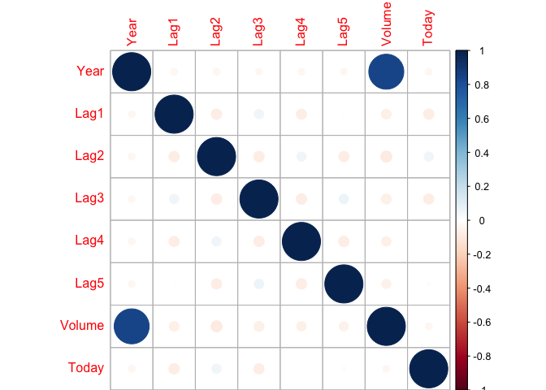

Just like the smarket data there seems to be no correlation between any predictors except volume and year which is expected, volume should be growing over time.

``` r
plot(Volume)
```

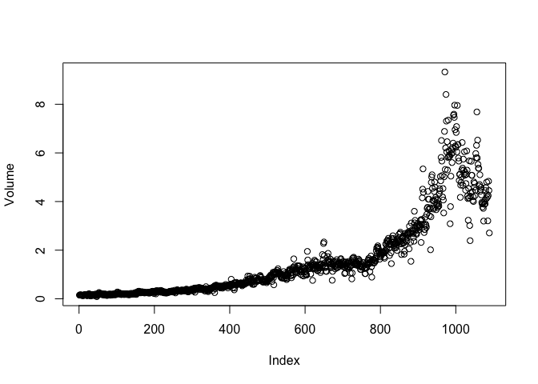

**b)**

``` r
glm.fit = glm(Direction ~ Lag1 + Lag2 + Lag3 + Lag4 + Lag5 + Volume, data=Weekly, family=binomial)
summary(glm.fit)
```

    ## 
    ## Call:
    ## glm(formula = Direction ~ Lag1 + Lag2 + Lag3 + Lag4 + Lag5 + 
    ##     Volume, family = binomial, data = Weekly)
    ## 
    ## Deviance Residuals: 
    ##     Min       1Q   Median       3Q      Max  
    ## -1.6949  -1.2565   0.9913   1.0849   1.4579  
    ## 
    ## Coefficients:
    ##             Estimate Std. Error z value Pr(>|z|)   
    ## (Intercept)  0.26686    0.08593   3.106   0.0019 **
    ## Lag1        -0.04127    0.02641  -1.563   0.1181   
    ## Lag2         0.05844    0.02686   2.175   0.0296 * 
    ## Lag3        -0.01606    0.02666  -0.602   0.5469   
    ## Lag4        -0.02779    0.02646  -1.050   0.2937   
    ## Lag5        -0.01447    0.02638  -0.549   0.5833   
    ## Volume      -0.02274    0.03690  -0.616   0.5377   
    ## ---
    ## Signif. codes:  0 '***' 0.001 '**' 0.01 '*' 0.05 '.' 0.1 ' ' 1
    ## 
    ## (Dispersion parameter for binomial family taken to be 1)
    ## 
    ##     Null deviance: 1496.2  on 1088  degrees of freedom
    ## Residual deviance: 1486.4  on 1082  degrees of freedom
    ## AIC: 1500.4
    ## 
    ## Number of Fisher Scoring iterations: 4

Lag2 has statistical significance.

**c)**

``` r
glm.prob = predict(glm.fit, type="response")
glm.pred = rep("Down", length(Direction))
glm.pred[glm.prob > 0.5] = "Up"
table(glm.pred, Direction)
```

    ##         Direction
    ## glm.pred Down  Up
    ##     Down   54  48
    ##     Up    430 557

``` r
mean(glm.pred == Direction)
```

    ## [1] 0.5610652

Overall prediction rate is 56.1%, the majority of the errors are in the false positive space. i.e. In this case meaning the model is bad at predicting when the market will go down, doing so at only 54/(430+54) = 11.1% accuracy.

**d)**

``` r
train = Year <= 2008
test = !train
glm.fit = glm(Direction ~ Lag2, data=Weekly, family=binomial, subset=train)
summary(glm.fit)
```

    ## 
    ## Call:
    ## glm(formula = Direction ~ Lag2, family = binomial, data = Weekly, 
    ##     subset = train)
    ## 
    ## Deviance Residuals: 
    ##    Min      1Q  Median      3Q     Max  
    ## -1.536  -1.264   1.021   1.091   1.368  
    ## 
    ## Coefficients:
    ##             Estimate Std. Error z value Pr(>|z|)   
    ## (Intercept)  0.20326    0.06428   3.162  0.00157 **
    ## Lag2         0.05810    0.02870   2.024  0.04298 * 
    ## ---
    ## Signif. codes:  0 '***' 0.001 '**' 0.01 '*' 0.05 '.' 0.1 ' ' 1
    ## 
    ## (Dispersion parameter for binomial family taken to be 1)
    ## 
    ##     Null deviance: 1354.7  on 984  degrees of freedom
    ## Residual deviance: 1350.5  on 983  degrees of freedom
    ## AIC: 1354.5
    ## 
    ## Number of Fisher Scoring iterations: 4

``` r
glm.prob = predict(glm.fit, Weekly[test, ], type="response")
glm.pred = rep("Down", length(Direction[test]))
glm.pred[glm.prob > 0.5] = "Up"
table(glm.pred, Direction[test])
```

    ##         
    ## glm.pred Down Up
    ##     Down    9  5
    ##     Up     34 56

``` r
mean(glm.pred == Direction[test])
```

    ## [1] 0.625

**e)**

``` r
library(MASS) # Needed to load in LDA
lda.fit = lda(Direction ~ Lag2, data=Weekly, subset=train)
lda.pred = predict(lda.fit, Weekly[test,])$class
table(lda.pred, Direction[test])
```

    ##         
    ## lda.pred Down Up
    ##     Down    9  5
    ##     Up     34 56

``` r
mean(lda.pred == Direction[test])
```

    ## [1] 0.625

**f)**

``` r
qda.fit = qda(Direction ~ Lag2, data=Weekly, subset=train)
qda.pred = predict(qda.fit, Weekly[test,])$class
table(qda.pred, Direction[test])
```

    ##         
    ## qda.pred Down Up
    ##     Down    0  0
    ##     Up     43 61

``` r
mean(qda.pred == Direction[test])
```

    ## [1] 0.5865385

**g)**

``` r
library(class)
set.seed(1) # To make this result reproducible
knn.pred = knn(data.frame(Lag2[train]), data.frame(Lag2[test]), Direction[train], k=1)
table(knn.pred, Direction[test])
```

    ##         
    ## knn.pred Down Up
    ##     Down   21 30
    ##     Up     22 31

``` r
mean(knn.pred == Direction[test])
```

    ## [1] 0.5

**h)**

Logistic regression and LDA give identical results, and are both superior to QDA and KNN (n=1).

**i)**

Let's go through some logistic regression models first.

``` r
glm.fit = glm(Direction ~ Lag1 + Lag2 + Lag3 + Lag4 + Lag5 + Volume, data=Weekly, family=binomial, subset=train)
summary(glm.fit)
```

    ## 
    ## Call:
    ## glm(formula = Direction ~ Lag1 + Lag2 + Lag3 + Lag4 + Lag5 + 
    ##     Volume, family = binomial, data = Weekly, subset = train)
    ## 
    ## Deviance Residuals: 
    ##     Min       1Q   Median       3Q      Max  
    ## -1.7186  -1.2498   0.9823   1.0841   1.4911  
    ## 
    ## Coefficients:
    ##             Estimate Std. Error z value Pr(>|z|)    
    ## (Intercept)  0.33258    0.09421   3.530 0.000415 ***
    ## Lag1        -0.06231    0.02935  -2.123 0.033762 *  
    ## Lag2         0.04468    0.02982   1.499 0.134002    
    ## Lag3        -0.01546    0.02948  -0.524 0.599933    
    ## Lag4        -0.03111    0.02924  -1.064 0.287241    
    ## Lag5        -0.03775    0.02924  -1.291 0.196774    
    ## Volume      -0.08972    0.05410  -1.658 0.097240 .  
    ## ---
    ## Signif. codes:  0 '***' 0.001 '**' 0.01 '*' 0.05 '.' 0.1 ' ' 1
    ## 
    ## (Dispersion parameter for binomial family taken to be 1)
    ## 
    ##     Null deviance: 1354.7  on 984  degrees of freedom
    ## Residual deviance: 1342.3  on 978  degrees of freedom
    ## AIC: 1356.3
    ## 
    ## Number of Fisher Scoring iterations: 4

On the training set it looks like only Lag1 has statistical significance, not Lag2 so let's try using that. This isn't really a good strategy, just seeing that statistical significance of predictors changed just by separating the full data into train and test sets implies there's no real significance there in the first place.

``` r
glm.fit = glm(Direction ~ Lag1, data=Weekly, family=binomial, subset=train)
summary(glm.fit)
```

    ## 
    ## Call:
    ## glm(formula = Direction ~ Lag1, family = binomial, data = Weekly, 
    ##     subset = train)
    ## 
    ## Deviance Residuals: 
    ##    Min      1Q  Median      3Q     Max  
    ## -1.519  -1.253   1.028   1.094   1.281  
    ## 
    ## Coefficients:
    ##             Estimate Std. Error z value Pr(>|z|)    
    ## (Intercept)  0.21829    0.06438   3.391 0.000697 ***
    ## Lag1        -0.05908    0.02892  -2.043 0.041059 *  
    ## ---
    ## Signif. codes:  0 '***' 0.001 '**' 0.01 '*' 0.05 '.' 0.1 ' ' 1
    ## 
    ## (Dispersion parameter for binomial family taken to be 1)
    ## 
    ##     Null deviance: 1354.7  on 984  degrees of freedom
    ## Residual deviance: 1350.4  on 983  degrees of freedom
    ## AIC: 1354.4
    ## 
    ## Number of Fisher Scoring iterations: 4

``` r
glm.prob = predict(glm.fit, Weekly[test, ], type="response")
glm.pred = rep("Down", length(Direction[test]))
glm.pred[glm.prob > 0.5] = "Up"
table(glm.pred, Direction[test])
```

    ##         
    ## glm.pred Down Up
    ##     Down    4  6
    ##     Up     39 55

``` r
mean(glm.pred == Direction[test])
```

    ## [1] 0.5673077

This actually performs worse than our previous logistic regression model, let's try an interaction effect between Lag1 and Lag2 for fun.

``` r
glm.fit = glm(Direction ~ Lag1*Lag2, data=Weekly, family=binomial, subset=train)
summary(glm.fit)
```

    ## 
    ## Call:
    ## glm(formula = Direction ~ Lag1 * Lag2, family = binomial, data = Weekly, 
    ##     subset = train)
    ## 
    ## Deviance Residuals: 
    ##    Min      1Q  Median      3Q     Max  
    ## -1.573  -1.259   1.003   1.086   1.596  
    ## 
    ## Coefficients:
    ##              Estimate Std. Error z value Pr(>|z|)   
    ## (Intercept)  0.211419   0.064589   3.273  0.00106 **
    ## Lag1        -0.051505   0.030727  -1.676  0.09370 . 
    ## Lag2         0.053471   0.029193   1.832  0.06700 . 
    ## Lag1:Lag2    0.001921   0.007460   0.257  0.79680   
    ## ---
    ## Signif. codes:  0 '***' 0.001 '**' 0.01 '*' 0.05 '.' 0.1 ' ' 1
    ## 
    ## (Dispersion parameter for binomial family taken to be 1)
    ## 
    ##     Null deviance: 1354.7  on 984  degrees of freedom
    ## Residual deviance: 1346.9  on 981  degrees of freedom
    ## AIC: 1354.9
    ## 
    ## Number of Fisher Scoring iterations: 4

``` r
glm.prob = predict(glm.fit, Weekly[test, ], type="response")
glm.pred = rep("Down", length(Direction[test]))
glm.pred[glm.prob > 0.5] = "Up"
table(glm.pred, Direction[test])
```

    ##         
    ## glm.pred Down Up
    ##     Down    7  8
    ##     Up     36 53

``` r
mean(glm.pred == Direction[test])
```

    ## [1] 0.5769231

The mixed term has no significance, again the model performs worse than the original. Let's experiment with different K values for KNN.

``` r
kvals = 1:300
error_rates = mapply(function(kval) {
        knn.pred = knn(data.frame(Lag2[train]), data.frame(Lag2[test]), Direction[train], k=kval)
        return(mean(knn.pred != Direction[test]))
    }, kvals)

invk = 1/kvals
plot(invk, error_rates, log="x", xlab="1/k", ylab="Error Rate")
```

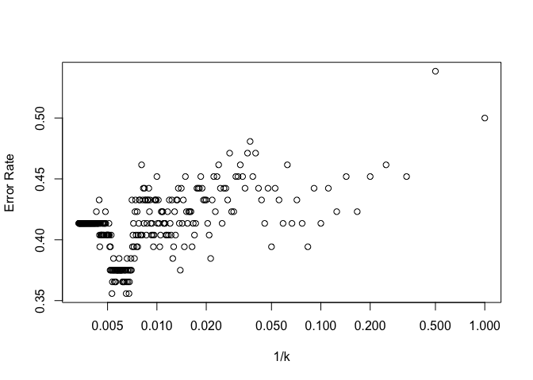

``` r
1-error_rates[160]
```

    ## [1] 0.625

Optimal k value is approximately 160 taking a look at the general trend and discounting outliers. The prediction rate at this point is 62.5% which is identical to the prediction rate of our original logistic regression and LDA models.

``` r
knn.pred = knn(data.frame(Lag2[train]), data.frame(Lag2[test]), Direction[train], k=160)
table(knn.pred, Direction[test])
```

    ##         
    ## knn.pred Down Up
    ##     Down   10  5
    ##     Up     33 56

The confusion matrix is also pretty similar to the matrices given by the original logistic regression and LDA models, the model is still quite bad at predicting weeks in which the market goes down but good at predicting when it goes up.

### 11.

``` r
detach(Weekly)
attach(Auto)
```

**a)**

``` r
mpg01 = rep(0, length(mpg))
mpg01[mpg > median(mpg)] = 1
Auto = data.frame(Auto, mpg01)
```

**b)**

So we've investigated associations with mpg in previous labs and we expect those associations to carry over to the newly created categorical variable mpg01. We can look at the pairs plot again to quickly spot associations with mpg, we can also create a series of boxplots to show definitively that these predictors have associations with mpg01. I haven't included every plot for brevity.

``` r
pairs(Auto)
```

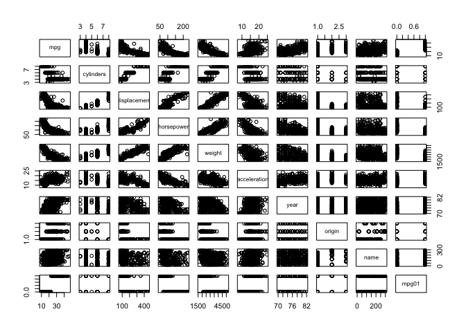

``` r
auto_normalized = scale(Auto[,-9])
boxplot(displacement ~ mpg01, ylab="Displacement", xlab="mpg01")
```

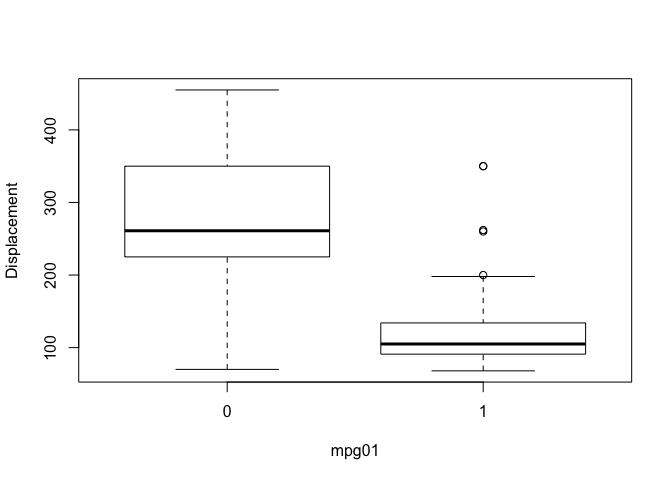

``` r
boxplot(weight ~ mpg01, ylab="Weight", xlab="mpg01")
```

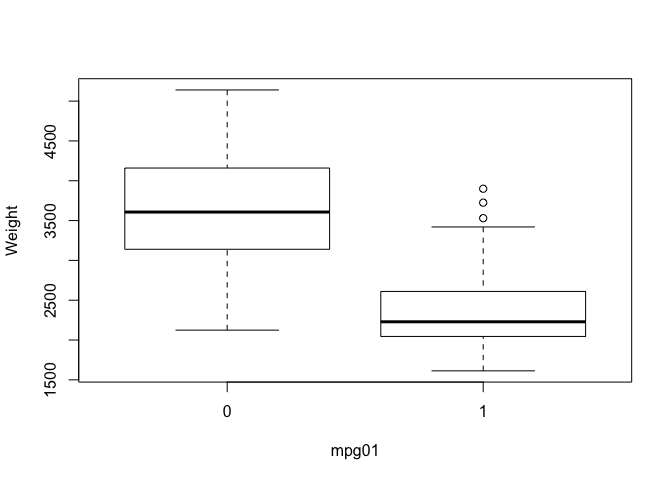

``` r
boxplot(horsepower ~ mpg01, ylab="Horsepower", xlab="mpg01")
```

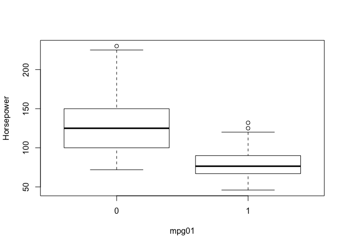

**c)**

There's 392 entries, lets use 75% for training and the remaining for test.

``` r
sample_size = floor(0.75 * nrow(Auto))
set.seed(1) # so the training data is reproducible
sample_part = sample(seq_len(nrow(Auto)), sample_size)

auto_training = Auto[sample_part, ]
auto_test = Auto[-sample_part, ]
mpg01_train = mpg01[sample_part]
mpg01_test = mpg01[-sample_part]
```

**d)**

``` r
lda.fit = lda(mpg01 ~ cylinders + displacement + horsepower + weight + year, data=auto_training)
lda.pred = predict(lda.fit, auto_test)$class
table(lda.pred, mpg01_test)
```

    ##         mpg01_test
    ## lda.pred  0  1
    ##        0 42  0
    ##        1  4 52

``` r
mean(lda.pred != mpg01_test)
```

    ## [1] 0.04081633

We see there's only a 4.1% error rate which is excellent. All the errors are focused in the false positive quadrant which has a class error rate of 4/(4+42) = 8.7%.

**e)**

``` r
qda.fit = qda(mpg01 ~ cylinders + displacement + horsepower + weight + year, data=auto_training)
qda.pred = predict(qda.fit, auto_test)$class
table(qda.pred, mpg01_test)
```

    ##         mpg01_test
    ## qda.pred  0  1
    ##        0 42  3
    ##        1  4 49

``` r
mean(qda.pred != mpg01_test)
```

    ## [1] 0.07142857

QDA performs slightly worse wth a 7.1% error rate.

**f)**

``` r
glm.fit = glm(mpg01 ~ cylinders + displacement + horsepower + weight + year, data=auto_training, family=binomial)
glm.prob = predict(glm.fit, auto_test, type="response")
glm.pred = rep(0, length(mpg01_test))
glm.pred[glm.prob > 0.5] = 1
table(glm.pred, mpg01_test)
```

    ##         mpg01_test
    ## glm.pred  0  1
    ##        0 40  2
    ##        1  6 50

``` r
mean(glm.pred != mpg01_test)
```

    ## [1] 0.08163265

There's a test error rate of 8.1% for our logistic regression model.

**g)**

Let's reuse the script we made in question 10.

``` r
train.X = cbind(auto_training$cylinders, auto_training$displacement, auto_training$horsepower, auto_training$weight, auto_training$year)
test.X = cbind(auto_test$cylinders, auto_test$displacement, auto_test$horsepower, auto_test$weight, auto_test$year)

nk = 50
kvals = 1:nk

error_rates = mapply(function(kval) {
        knn.pred = knn(train.X, test.X, mpg01_train, k=kval)
        return(mean(knn.pred != mpg01_test))
    }, kvals)

plot(error_rates, xlab="k", ylab="Error Rate")
```

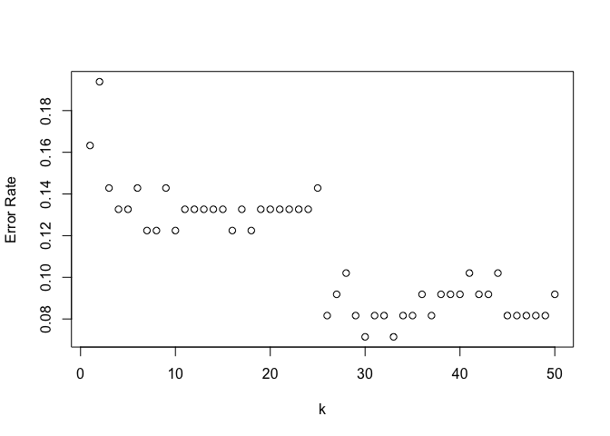

``` r
error_rates[33]
```

    ## [1] 0.07142857

Best performance seems to be around k=33 which corresponds to an error rate of 7.1%, but none of this matches our original LDA model.

### 12.

**a)**

``` r
Power = function() {
    print(2^3)
}

Power()
```

    ## [1] 8

**b)**

``` r
Power2 = function(x, a) {
    print(x^a)
}

Power2(3, 8)
```

    ## [1] 6561

**c)**

``` r
Power2(10, 3)
```

    ## [1] 1000

``` r
Power2(8, 17)
```

    ## [1] 2.2518e+15

``` r
Power2(131, 3)
```

    ## [1] 2248091

**d)**

``` r
Power3 = function(x, a) {
    result = x^a
    return(result)
}

Power3(3, 8)
```

    ## [1] 6561

**e)**

``` r
plot(1:10, Power3(1:10, 2), log="xy")
```

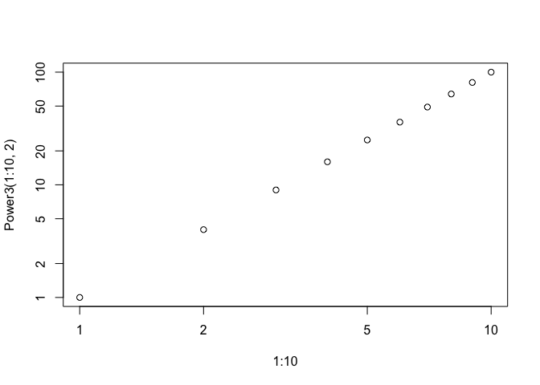

**f)**

``` r
PlotPower = function(x, a) {
    plot(x, Power3(x, a))
}

PlotPower(1:10, 3)
```

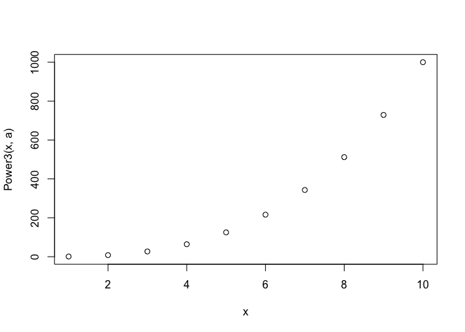

### 13.

``` r
library(MASS)
attach(Boston)
```

``` r
crim01 = rep(0, length(crim))
crim01[crim > median(crim)] = 1

Boston = data.frame(Boston, crim01)
pairs(Boston)
```

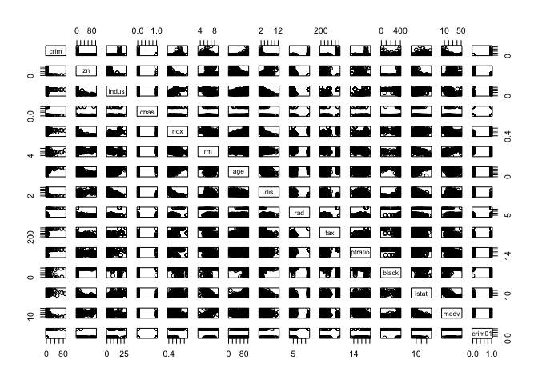

Let's split the data into training and test sets first.

``` r
sample_size = floor(0.75 * nrow(Boston))
set.seed(1) # so the training data is reproducible
training = sample(seq_len(nrow(Boston)), sample_size)
test = setdiff(c(1:nrow(Boston)), training)
```

I've done a few different ways of splitting training and test sets in this exercise just to see what I like best, this is probably my favourite but do whatever works best for you.

``` r
glm.fit = glm(crim01 ~ . -crim, data=Boston, family=binomial, subset=training)
summary(glm.fit)
```

    ## 
    ## Call:
    ## glm(formula = crim01 ~ . - crim, family = binomial, data = Boston, 
    ##     subset = training)
    ## 
    ## Deviance Residuals: 
    ##     Min       1Q   Median       3Q      Max  
    ## -1.7109  -0.1721   0.0001   0.0054   3.5188  
    ## 
    ## Coefficients:
    ##               Estimate Std. Error z value Pr(>|z|)    
    ## (Intercept) -33.939299   7.488211  -4.532 5.83e-06 ***
    ## zn           -0.078757   0.038047  -2.070  0.03845 *  
    ## indus        -0.070021   0.052616  -1.331  0.18326    
    ## chas          0.401738   0.853233   0.471  0.63775    
    ## nox          47.398517   8.643372   5.484 4.16e-08 ***
    ## rm           -0.331606   0.809108  -0.410  0.68192    
    ## age           0.042799   0.015352   2.788  0.00531 ** 
    ## dis           0.746777   0.262032   2.850  0.00437 ** 
    ## rad           0.586171   0.179218   3.271  0.00107 ** 
    ## tax          -0.006918   0.003313  -2.088  0.03678 *  
    ## ptratio       0.250405   0.141495   1.770  0.07678 .  
    ## black        -0.006728   0.005234  -1.285  0.19864    
    ## lstat        -0.011002   0.059629  -0.185  0.85362    
    ## medv          0.120250   0.076044   1.581  0.11380    
    ## ---
    ## Signif. codes:  0 '***' 0.001 '**' 0.01 '*' 0.05 '.' 0.1 ' ' 1
    ## 
    ## (Dispersion parameter for binomial family taken to be 1)
    ## 
    ##     Null deviance: 525.38  on 378  degrees of freedom
    ## Residual deviance: 159.39  on 365  degrees of freedom
    ## AIC: 187.39
    ## 
    ## Number of Fisher Scoring iterations: 9

Let's take zn, nox, age, dis, rad and tax and remove the other predictors from the model.

``` r
glm.fit = glm(crim01 ~ zn + nox + age + dis + rad + tax, data=Boston, family=binomial, subset=training)
summary(glm.fit)
```

    ## 
    ## Call:
    ## glm(formula = crim01 ~ zn + nox + age + dis + rad + tax, family = binomial, 
    ##     data = Boston, subset = training)
    ## 
    ## Deviance Residuals: 
    ##     Min       1Q   Median       3Q      Max  
    ## -1.8364  -0.2071   0.0002   0.0049   3.2311  
    ## 
    ## Coefficients:
    ##               Estimate Std. Error z value Pr(>|z|)    
    ## (Intercept) -24.288383   4.209607  -5.770 7.94e-09 ***
    ## zn           -0.074738   0.031375  -2.382  0.01721 *  
    ## nox          36.799242   6.671607   5.516 3.47e-08 ***
    ## age           0.032198   0.011138   2.891  0.00384 ** 
    ## dis           0.488325   0.208636   2.341  0.01925 *  
    ## rad           0.674803   0.151494   4.454 8.42e-06 ***
    ## tax          -0.009189   0.002797  -3.285  0.00102 ** 
    ## ---
    ## Signif. codes:  0 '***' 0.001 '**' 0.01 '*' 0.05 '.' 0.1 ' ' 1
    ## 
    ## (Dispersion parameter for binomial family taken to be 1)
    ## 
    ##     Null deviance: 525.38  on 378  degrees of freedom
    ## Residual deviance: 170.59  on 372  degrees of freedom
    ## AIC: 184.59
    ## 
    ## Number of Fisher Scoring iterations: 9

And finally evaluate our test error rate.

``` r
glm.prob = predict(glm.fit, Boston[test,], family=binomial, type="response")
glm.pred = rep(0, length(crim01[test]))
glm.pred[glm.prob > 0.5] = 1

table(glm.pred, crim01[test])
```

    ##         
    ## glm.pred  0  1
    ##        0 57  9
    ##        1  8 53

``` r
mean(glm.pred != crim01[test])
```

    ## [1] 0.1338583

Test error rate for logistic regression model here is 13.3%.

Let's evaluate LDA now.

``` r
lda.fit = lda(crim01 ~ zn + nox + age + dis + rad + tax, data=Boston, subset=training)
lda.pred = predict(lda.fit, Boston[test,])$class

table(lda.pred, crim01[test])
```

    ##         
    ## lda.pred  0  1
    ##        0 62 17
    ##        1  3 45

``` r
mean(lda.pred != crim01[test])
```

    ## [1] 0.1574803

Test error rate for LDA model is 15.7%

Onto QDA.

``` r
qda.fit = qda(crim01 ~ zn + nox + age + dis + rad + tax, data=Boston, subset=training)
qda.pred = predict(qda.fit, Boston[test,])$class

table(qda.pred, crim01[test])
```

    ##         
    ## qda.pred  0  1
    ##        0 62 11
    ##        1  3 51

``` r
mean(qda.pred != crim01[test])
```

    ## [1] 0.1102362

QDA has the best performance thus far with a test error rate of 11.0%

Finally KNN reusing the script we've been using throughout this chapter.

``` r
train.X = cbind(zn, nox, age, dis, rad, tax)[training,]
test.X = cbind(zn, nox, age, dis, rad, tax)[test, ]
train.Y = crim01[training]
test.Y = crim01[test]

nk = 100
kvals = 1:nk

error_rates = mapply(function(kval) {
        set.seed(1)
        knn.pred = knn(train.X, test.X, train.Y, k=kval)
        return(mean(knn.pred != test.Y))
    }, kvals)

plot(error_rates, xlab="k", ylab="Error Rate")
```

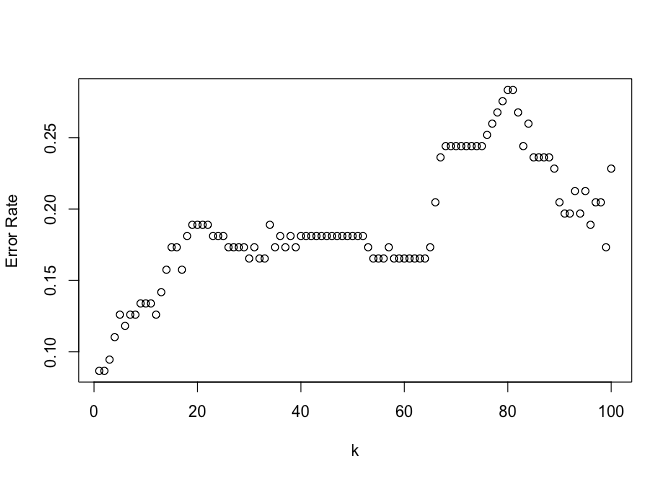

1-NN has the best performance with a test error rate of 8.6%. To be honest I'm not entirely sure what to make of this, it could be implying there's a high degree of non-linearity in the required model which may help explain why QDA performs slightly better than logistic regression or LDA.