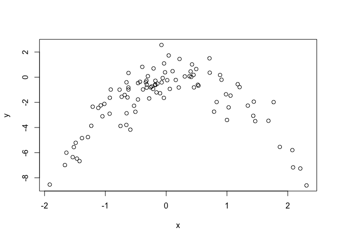

<h1 class="post-subtitle">Conceptual</h1>

### 1.

$$
\begin{align*}
f(\alpha) &= Var(\alpha X + (1-\alpha)Y) \\
&=  Var(\alpha X) + Var((1-\alpha)Y) + 2Cov(\alpha X, (1-\alpha)Y) \\
&= \alpha^2Var(X) + (1-\alpha)^2Var(Y) + 2\alpha(1-\alpha)Cov(X,Y) \\
&= \alpha^2\sigma_X^2 + (1-\alpha)^2\sigma_Y^2 + 2\alpha(1-\alpha)\sigma_{X,Y}
\end{align*}
$$

Then calculate the derivative with respect to $\alpha$, remember X and Y are constants here.

$$
\begin{align*}
\frac{df(\alpha)}{d\alpha} &= 2\alpha\sigma_X^2 - 2(1-\alpha)\sigma_Y^2 + 2(1-2\alpha)\sigma_{X,Y}
\end{align*}
$$

Set derivative equal to zero and solve for $\alpha$ to find minima, maxima.

$$
\begin{align*}
0 &= \alpha\sigma_X^2 - (1-\alpha)\sigma_Y^2 + (1-2\alpha)\sigma_{X,Y} \\
\alpha\sigma_X^2 + \alpha\sigma_Y^2 - 2\alpha\sigma_{X,Y} &= \sigma_Y^2 - \sigma_{X,Y} \\
\alpha &= \frac{\sigma_Y^2 - \sigma_{X,Y}}{\sigma_X^2 + \sigma_Y^2 - 2\sigma_{X,Y}}
\end{align*}
$$

### 2.

**a)**

Any observation in the bootstrap sample is drawn from the entirety of the set where each observation has an equal chance to be picked, therefore the chance that the first bootstrap sample is not a single particular observation in the set is (n-1)/n.

**b)**

Bootstrap allows repetition of picked observations so the same, (n-1)/n.

**c)**

First notice that $(1-1/n)$ = $(n-1)/n$. The chance a particular observation is not in the bootstrap sample is simply the odds that observation is not picked for a particular bootstrap observation n times in a row. i.e. $(1-1/n)^n$.

**d)**

$ 1 - (1-1/5)^5 = 0.67$

**e)**

$ 1 - (1 - 1/100)^{100} = 0.63$

**f)**

$ 1 - (1 - 1/10000)^{10000} = 0.63$

**g)**


The probability converges to appoximately 63.2% from above as n increases.

**h)**

64% which is in line with what we expect for a relatively smaller value of n.

### 3.

**a)**

Split a training set of size $n$ into $k$ equally sized 'folds'. Train the model on all folds except one which you designate as the validation fold, then calcualte CV score on the validation fold. Iterate over all k folds so each has a turn as the validation fold. Take the mean of the CV scores for a final estimate of test error.

**b)**

**i.**

The validation set approach has two big disadvantages. You reduce the amount of data you have available to train your model on, and the estimate of the test error is thas high variance. k-fold CV addresses both of these problems, you are able to train your model on almost all of the data set and there's typically lower variance in the test error estimate. The disadvantage of k-fold CV is in its higher computational cost.

**ii.**

LOOCV has a lower computational requirement compared to k-fold CV in the case of least-squares regression models as it only requires a single model fit to calculate, though in other settings k-fold CV ($k < n$) has a lower computational requirement. k-fold CV also typically gives more accurate estimates of the test error than LOOCV as there's less correlation in the MSE vector which results in lower variance in the CV calculation.

### 4.

Here we just outline the bootstrap method. We want to estimate the s.d of our prediction $\hat{Y}$, so we need a sample set of predictors $\hat{Y}$ for our fixed input parameter. We build the sample set by creating a bootstrap sample (random selection with repetition allowed) from the original data required to make our prediction $\hat{Y}$. We then simply compute the SE of $\hat{Y}$ from this sample set.

<br><br>

<h1 class="post-subtitle">Applied</h1>


### 5.

``` r
library(ISLR)
attach(Default)
set.seed(1)
```

**a)**

``` r
glm.fit = glm(default ~ income + balance, data=Default, family=binomial)
```

**b)**

We'll split the full set 50/50 into training and validation then do our model fit and analysis.

``` r
default_vs_error = function() {
    train = sample(nrow(Default), nrow(Default)/2)
    glm.fit.vs = glm(default ~ income + balance, data=Default, family=binomial, subset=train)
    vs.probs = predict(glm.fit.vs, Default[-train, ], type="response")
    vs.preds = rep("No", nrow(Default[-train, ]))
    vs.preds[vs.probs > 0.5] = "Yes"
    
    return (mean(vs.preds != default[-train]))
}

default_vs_error()
```

    ## [1] 0.0286

**c)**

``` r
default_vs_error()
```

    ## [1] 0.0236

``` r
default_vs_error()
```

    ## [1] 0.028

``` r
default_vs_error()
```

    ## [1] 0.0268

We see some significant variation as expected when the training set changes.

**d)**

``` r
train = sample(nrow(Default), nrow(Default)/2)
glm.fit.vs = glm(default ~ income + balance + student, data=Default, family=binomial, subset=train)
vs.probs = predict(glm.fit.vs, Default[-train, ], type="response")
vs.preds = rep("No", nrow(Default[-train, ]))
vs.preds[vs.probs > 0.5] = "Yes"
    
mean(vs.preds != default[-train])
```

    ## [1] 0.0264

There's no statistically significant difference in the test error rate estimation using the validation set approach whether we include the student dummy variable or not.

### 6.

``` r
set.seed(1)
```

**a)**

``` r
glm.fit = glm(default ~ income + balance, data=Default, family=binomial, subset=train)
summary(glm.fit)
```

    ## 
    ## Call:
    ## glm(formula = default ~ income + balance, family = binomial, 
    ##     data = Default, subset = train)
    ## 
    ## Deviance Residuals: 
    ##     Min       1Q   Median       3Q      Max  
    ## -2.1731  -0.1498  -0.0625  -0.0247   3.6567  
    ## 
    ## Coefficients:
    ##               Estimate Std. Error z value Pr(>|z|)    
    ## (Intercept) -1.117e+01  5.960e-01 -18.741  < 2e-16 ***
    ## income       1.996e-05  6.996e-06   2.854  0.00432 ** 
    ## balance      5.462e-03  3.119e-04  17.514  < 2e-16 ***
    ## ---
    ## Signif. codes:  0 '***' 0.001 '**' 0.01 '*' 0.05 '.' 0.1 ' ' 1
    ## 
    ## (Dispersion parameter for binomial family taken to be 1)
    ## 
    ##     Null deviance: 1463.69  on 4999  degrees of freedom
    ## Residual deviance:  817.62  on 4997  degrees of freedom
    ## AIC: 823.62
    ## 
    ## Number of Fisher Scoring iterations: 8

SE for income is approximately 7e-6 and SE for balance is approxmiately 3.1e-4.

**b)**

``` r
boot.fn = function(dataset, train_index) {
    glm.fit = glm(default ~ income + balance, 
                data=dataset, 
                family=binomial, 
                subset=train_index)
    
    return (c(coef(glm.fit)["income"], coef(glm.fit)["balance"]))
}
```

**c)**

This takes a little while to run (~40s on my machine).

``` r
library(boot)
boot(Default, boot.fn, R=1000)
```

    ## 
    ## ORDINARY NONPARAMETRIC BOOTSTRAP
    ## 
    ## 
    ## Call:
    ## boot(data = Default, statistic = boot.fn, R = 1000)
    ## 
    ## 
    ## Bootstrap Statistics :
    ##         original       bias     std. error
    ## t1* 2.080898e-05 5.870933e-08 4.582525e-06
    ## t2* 5.647103e-03 2.299970e-06 2.267955e-04

|         | Bootstrap | Standard Formula (glm) |
|---------|-----------|------------------------|
| Income  | 4.58e-6   | 7.00e-6                |
| Balance | 2.27e-4   | 3.12e-4                |
{:.mtablestyle}

The SE calculated using the bootstrap method are smaller.

### 7.

``` r
detach(Default)
attach(Weekly)
```

**a)**

``` r
glm.fit = glm(Direction ~ Lag1 + Lag2, data=Weekly, family=binomial)
```

**b)**

``` r
glm.fit.loocv = glm(Direction ~ Lag1 + Lag2, data=Weekly, family=binomial, subset=-c(1))
```

**c)**

``` r
predict(glm.fit.loocv, Weekly[1, ], type="response")
```

    ##         1 
    ## 0.5713923

Therefore we predict the market to go up.

``` r
Direction[1]
```

    ## [1] Down
    ## Levels: Down Up

But the actual direction is down so we're wrong.

``` r
weekly_loocv = function(i) {
    glm.fit.loocv = glm(Direction ~ Lag1 + Lag2, data=Weekly, family=binomial, subset=-c(i))
    if (predict(glm.fit.loocv, Weekly[i, ], type="response") > 0.5) {
        predict = "Up"
    }
    else {
        predict = "Down"
    }
    
    if (predict != Direction[i]) {
        return (1)
    }
    return (0)
}

err = rep(0, nrow(Weekly))
for (i in 1:nrow(Weekly)) {
    err[i] = weekly_loocv(i)
}

mean(err)
```

    ## [1] 0.4499541

LOOCV estimates a test error rate of 45%.

### 8.

**a)**

``` r
set.seed(1)
y = rnorm(100)
x = rnorm(100)
y = x - 2*x^2 + rnorm(100)
```

n = 100, p = 2.

$$ Y = X - 2X^2 + \epsilon$$

**b)**

``` r
plot(x, y)
```



Concave parabola with some degree of noise (as expected from the equation).

**c)**

``` r
set.seed(1)
SimData = data.frame(x, y)
```

**i.**

``` r
lm.fit = glm(y ~ poly(x, 1), data=SimData)
cv.glm(SimData, lm.fit)$delta
```

    ## [1] 5.890979 5.888812

**ii.**

``` r
lm.fit = glm(y ~ poly(x, 2), data=SimData)
cv.glm(SimData, lm.fit)$delta
```

    ## [1] 1.086596 1.086326

**iii.**

``` r
lm.fit = glm(y ~ poly(x, 3), data=SimData)
cv.glm(SimData, lm.fit)$delta
```

    ## [1] 1.102585 1.102227

**iv.**

``` r
lm.fit = glm(y ~ poly(x, 4), data=SimData)
cv.glm(SimData, lm.fit)$delta
```

    ## [1] 1.114772 1.114334

**d)**

``` r
set.seed(2)
```

**i.**

``` r
lm.fit = glm(y ~ poly(x, 1), data=SimData)
cv.glm(SimData, lm.fit)$delta
```

    ## [1] 5.890979 5.888812

**ii.**

``` r
lm.fit = glm(y ~ poly(x, 2), data=SimData)
cv.glm(SimData, lm.fit)$delta
```

    ## [1] 1.086596 1.086326

**iii.**

``` r
lm.fit = glm(y ~ poly(x, 3), data=SimData)
cv.glm(SimData, lm.fit)$delta
```

    ## [1] 1.102585 1.102227

**iv.**

``` r
lm.fit = glm(y ~ poly(x, 4), data=SimData)
cv.glm(SimData, lm.fit)$delta
```

    ## [1] 1.114772 1.114334

The results are identical as expected, LOOCV errors are deterministic, there is no randomosity stemming from training subset selection.

**e)**

The quadratic model, as expected as the underlying equation is qudratic.

**f)**

``` r
summary(glm(y ~ poly(x, 1), data=SimData))
```

    ## 
    ## Call:
    ## glm(formula = y ~ poly(x, 1), data = SimData)
    ## 
    ## Deviance Residuals: 
    ##     Min       1Q   Median       3Q      Max  
    ## -7.3469  -0.9275   0.8028   1.5608   4.3974  
    ## 
    ## Coefficients:
    ##             Estimate Std. Error t value Pr(>|t|)    
    ## (Intercept)  -1.8277     0.2362  -7.737 9.18e-12 ***
    ## poly(x, 1)    2.3164     2.3622   0.981    0.329    
    ## ---
    ## Signif. codes:  0 '***' 0.001 '**' 0.01 '*' 0.05 '.' 0.1 ' ' 1
    ## 
    ## (Dispersion parameter for gaussian family taken to be 5.580018)
    ## 
    ##     Null deviance: 552.21  on 99  degrees of freedom
    ## Residual deviance: 546.84  on 98  degrees of freedom
    ## AIC: 459.69
    ## 
    ## Number of Fisher Scoring iterations: 2

``` r
summary(glm(y ~ poly(x, 2), data=SimData))
```

    ## 
    ## Call:
    ## glm(formula = y ~ poly(x, 2), data = SimData)
    ## 
    ## Deviance Residuals: 
    ##      Min        1Q    Median        3Q       Max  
    ## -2.89884  -0.53765   0.04135   0.61490   2.73607  
    ## 
    ## Coefficients:
    ##             Estimate Std. Error t value Pr(>|t|)    
    ## (Intercept)  -1.8277     0.1032 -17.704   <2e-16 ***
    ## poly(x, 2)1   2.3164     1.0324   2.244   0.0271 *  
    ## poly(x, 2)2 -21.0586     1.0324 -20.399   <2e-16 ***
    ## ---
    ## Signif. codes:  0 '***' 0.001 '**' 0.01 '*' 0.05 '.' 0.1 ' ' 1
    ## 
    ## (Dispersion parameter for gaussian family taken to be 1.06575)
    ## 
    ##     Null deviance: 552.21  on 99  degrees of freedom
    ## Residual deviance: 103.38  on 97  degrees of freedom
    ## AIC: 295.11
    ## 
    ## Number of Fisher Scoring iterations: 2

``` r
summary(glm(y ~ poly(x, 3), data=SimData))
```

    ## 
    ## Call:
    ## glm(formula = y ~ poly(x, 3), data = SimData)
    ## 
    ## Deviance Residuals: 
    ##      Min        1Q    Median        3Q       Max  
    ## -2.87250  -0.53881   0.02862   0.59383   2.74350  
    ## 
    ## Coefficients:
    ##             Estimate Std. Error t value Pr(>|t|)    
    ## (Intercept)  -1.8277     0.1037 -17.621   <2e-16 ***
    ## poly(x, 3)1   2.3164     1.0372   2.233   0.0279 *  
    ## poly(x, 3)2 -21.0586     1.0372 -20.302   <2e-16 ***
    ## poly(x, 3)3  -0.3048     1.0372  -0.294   0.7695    
    ## ---
    ## Signif. codes:  0 '***' 0.001 '**' 0.01 '*' 0.05 '.' 0.1 ' ' 1
    ## 
    ## (Dispersion parameter for gaussian family taken to be 1.075883)
    ## 
    ##     Null deviance: 552.21  on 99  degrees of freedom
    ## Residual deviance: 103.28  on 96  degrees of freedom
    ## AIC: 297.02
    ## 
    ## Number of Fisher Scoring iterations: 2

``` r
summary(glm(y ~ poly(x, 4), data=SimData))
```

    ## 
    ## Call:
    ## glm(formula = y ~ poly(x, 4), data = SimData)
    ## 
    ## Deviance Residuals: 
    ##     Min       1Q   Median       3Q      Max  
    ## -2.8914  -0.5244   0.0749   0.5932   2.7796  
    ## 
    ## Coefficients:
    ##             Estimate Std. Error t value Pr(>|t|)    
    ## (Intercept)  -1.8277     0.1041 -17.549   <2e-16 ***
    ## poly(x, 4)1   2.3164     1.0415   2.224   0.0285 *  
    ## poly(x, 4)2 -21.0586     1.0415 -20.220   <2e-16 ***
    ## poly(x, 4)3  -0.3048     1.0415  -0.293   0.7704    
    ## poly(x, 4)4  -0.4926     1.0415  -0.473   0.6373    
    ## ---
    ## Signif. codes:  0 '***' 0.001 '**' 0.01 '*' 0.05 '.' 0.1 ' ' 1
    ## 
    ## (Dispersion parameter for gaussian family taken to be 1.084654)
    ## 
    ##     Null deviance: 552.21  on 99  degrees of freedom
    ## Residual deviance: 103.04  on 95  degrees of freedom
    ## AIC: 298.78
    ## 
    ## Number of Fisher Scoring iterations: 2

Yes, the higher order (3rd and 4th) elements are statistically insignificant and so is the linear term in isolation. This validates the CV results as there's no statistically significant improvement in LOOCV error as we move from the quadratic model to the cubic and quartic models, but there is a significant improvement in moving from linear to quadratic.

### 9.

``` r
detach(Weekly)
library(MASS)
attach(Boston)
```

**a)**

``` r
set.seed(1)
mean(medv)
```

    ## [1] 22.53281

**b)**

``` r
sd(medv)/sqrt(nrow(Boston))
```

    ## [1] 0.4088611

Not sure what to interpret here, it's just the standard error of the sample mean.

**c)**

``` r
mean.fn = function(dataset, indices) {
    return (mean(dataset[indices]))
}

boot(medv, mean.fn, R=1000)
```

    ## 
    ## ORDINARY NONPARAMETRIC BOOTSTRAP
    ## 
    ## 
    ## Call:
    ## boot(data = medv, statistic = mean.fn, R = 1000)
    ## 
    ## 
    ## Bootstrap Statistics :
    ##     original      bias    std. error
    ## t1* 22.53281 0.008517589   0.4119374

We can see that the estimate for the mean is identical, the SE is very barely larger as estimated by the bootstrap method (0.412 vs 0.409).

**d)**

``` r
t.test(medv)
```

    ## 
    ##  One Sample t-test
    ## 
    ## data:  medv
    ## t = 55.111, df = 505, p-value < 2.2e-16
    ## alternative hypothesis: true mean is not equal to 0
    ## 95 percent confidence interval:
    ##  21.72953 23.33608
    ## sample estimates:
    ## mean of x 
    ##  22.53281

``` r
22.53281 - 2*(0.4119374) # boostrap 95% CI lb
```

    ## [1] 21.70894

``` r
22.53281 + 2*(0.4119374) # boostrap 95% CI ub
```

    ## [1] 23.35668

Again very similar but the bootstrap method has a slightly wider interval.

**e)**

``` r
median(medv)
```

    ## [1] 21.2

**f)**

``` r
median.fn = function(dataset, indices) {
    return (median(dataset[indices]))
}

boot(medv, median.fn, R=1000)
```

    ## 
    ## ORDINARY NONPARAMETRIC BOOTSTRAP
    ## 
    ## 
    ## Call:
    ## boot(data = medv, statistic = median.fn, R = 1000)
    ## 
    ## 
    ## Bootstrap Statistics :
    ##     original  bias    std. error
    ## t1*     21.2 -0.0098   0.3874004

**g)**

``` r
quantile(medv, 0.1)
```

    ##   10% 
    ## 12.75

**h)**

``` r
tenPer.fn = function(dataset, indices) {
    return (quantile(dataset[indices], 0.1))
}

boot(medv, tenPer.fn, R=1000)
```

    ## 
    ## ORDINARY NONPARAMETRIC BOOTSTRAP
    ## 
    ## 
    ## Call:
    ## boot(data = medv, statistic = tenPer.fn, R = 1000)
    ## 
    ## 
    ## Bootstrap Statistics :
    ##     original  bias    std. error
    ## t1*    12.75 0.00515   0.5113487

