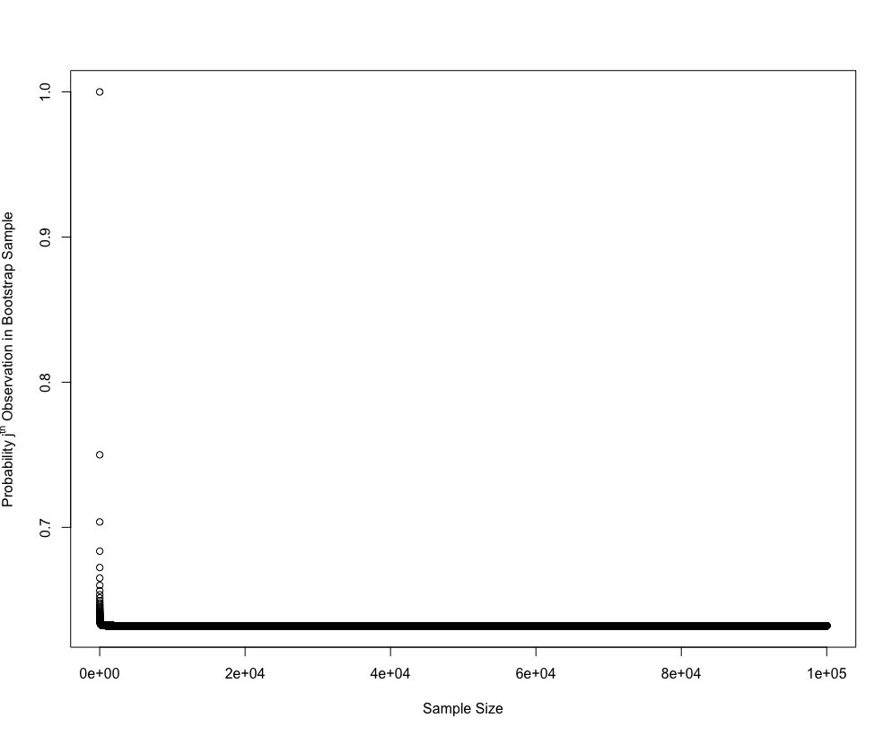

<h1 class="post-subtitle">Conceptual</h1>

### 1.

$$
\begin{align*}
f(\alpha) &= Var(\alpha X + (1-\alpha)Y) \\
&=  Var(\alpha X) + Var((1-\alpha)Y) + 2Cov(\alpha X, (1-\alpha)Y) \\
&= \alpha^2Var(X) + (1-\alpha)^2Var(Y) + 2\alpha(1-\alpha)Cov(X,Y) \\
&= \alpha^2\sigma_X^2 + (1-\alpha)^2\sigma_Y^2 + 2\alpha(1-\alpha)\sigma_{X,Y}
\end{align*}
$$

Then calculate the derivative with respect to $\alpha$, remember X and Y are constants here.

$$
\begin{align*}
\frac{df(\alpha)}{d\alpha} &= 2\alpha\sigma_X^2 - 2(1-\alpha)\sigma_Y^2 + 2(1-2\alpha)\sigma_{X,Y}
\end{align*}
$$

Set derivative equal to zero and solve for $\alpha$ to find minima, maxima.

$$
\begin{align*}
0 &= \alpha\sigma_X^2 - (1-\alpha)\sigma_Y^2 + (1-2\alpha)\sigma_{X,Y} \\
\alpha\sigma_X^2 + \alpha\sigma_Y^2 - 2\alpha\sigma_{X,Y} &= \sigma_Y^2 - \sigma_{X,Y} \\
\alpha &= \frac{\sigma_Y^2 - \sigma_{X,Y}}{\sigma_X^2 + \sigma_Y^2 - 2\sigma_{X,Y}}
\end{align*}
$$

### 2.

**a)**

Any observation in the bootstrap sample is drawn from the entirety of the set where each observation has an equal chance to be picked, therefore the chance that the first bootstrap sample is not a single particular observation in the set is (n-1)/n.

**b)**

Bootstrap allows repetition of picked observations so the same, (n-1)/n.

**c)**

First notice that $(1-1/n)$ = $(n-1)/n$. The chance a particular observation is not in the bootstrap sample is simply the odds that observation is not picked for a particular bootstrap observation n times in a row. i.e. $(1-1/n)^n$.

**d)**

$ 1 - (1-1/5)^5 = 0.67$

**e)**

$ 1 - (1 - 1/100)^{100} = 0.63$

**f)**

$ 1 - (1 - 1/10000)^{10000} = 0.63$

**g)**

The probability converges to appoximately 63.2% from above as n increases.

**h)**

64% which is in line with what we expect for a relatively smaller value of n.

### 3.

**a)**

Split a training set of size $n$ into $k$ equally sized 'folds'. Train the model on all folds except one which you designate as the validation fold, then calcualte CV score on the validation fold. Iterate over all k folds so each has a turn as the validation fold. Take the mean of the CV scores for a final estimate of test error.

**b)**

**i.**

The validation set approach has two big disadvantages. You reduce the amount of data you have available to train your model on, and the estimate of the test error is thas high variance. k-fold CV addresses both of these problems, you are able to train your model on almost all of the data set and there's typically lower variance in the test error estimate. The disadvantage of k-fold CV is in its higher computational cost.

**ii.**

LOOCV has a lower computational requirement compared to k-fold CV in the case of least-squares regression models as it only requires a single model fit to calculate, though in other settings k-fold CV ($k < n$) has a lower computational requirement. k-fold CV also typically gives more accurate estimates of the test error than LOOCV as there's less correlation in the MSE vector which results in lower variance in the CV calculation.

### 4.

Here we just outline the bootstrap method. We want to estimate the s.d of our prediction $\hat{Y}$, so we need a sample set of predictors $\hat{Y}$ for our fixed input parameter. We build the sample set by creating a bootstrap sample (random selection with repetition allowed) from the original data required to make our prediction $\hat{Y}$. We then simply compute the SE of $\hat{Y}$ from this sample set.

