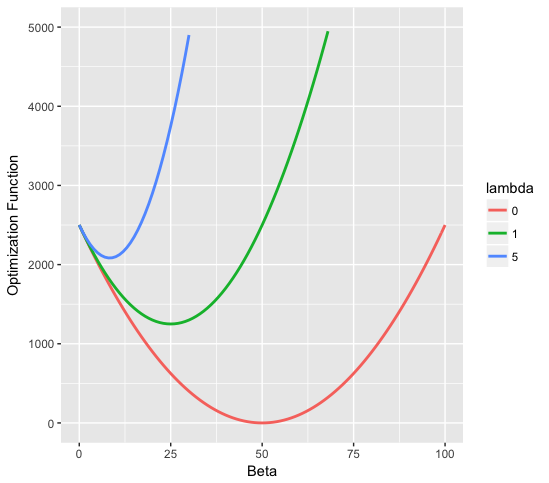
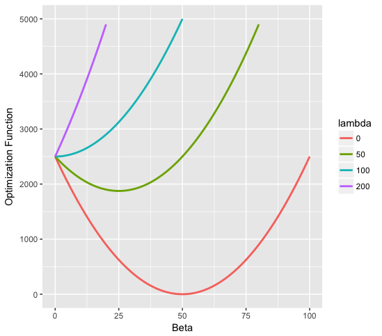
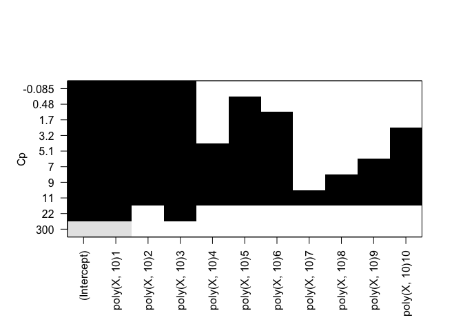
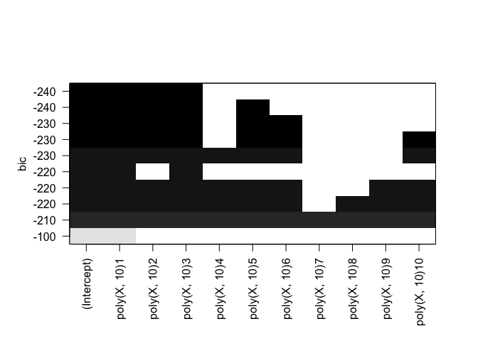
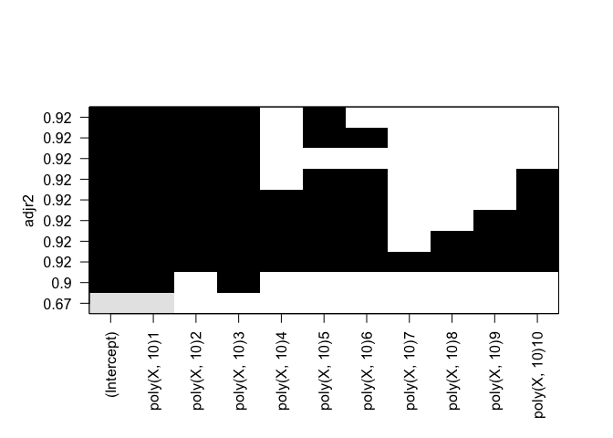
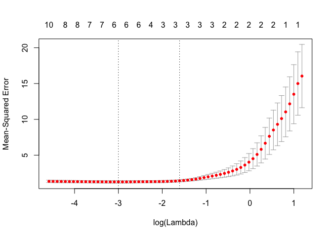
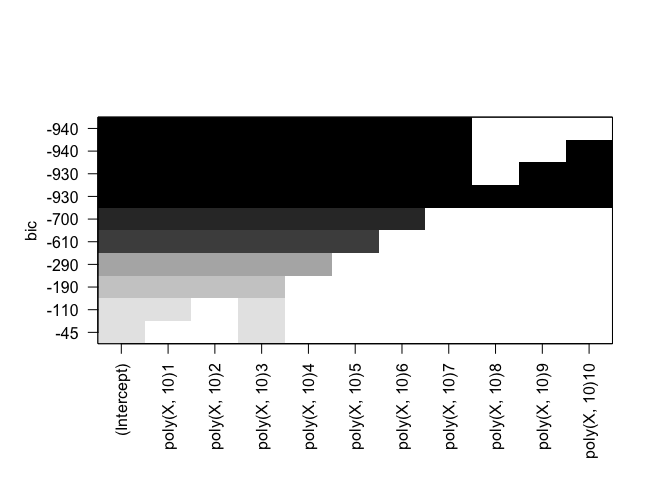
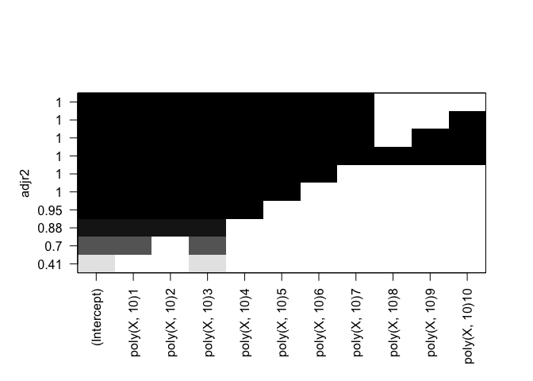

<h1 class="post-subtitle">Conceptual</h1>

### 1.

**a)**

The best subset selection model for a given number of predictors will have an $RSS$ either smaller than or equal to the RSS of either stepwise selection model for the same number of predictors. This is because the metric determining model selection for a given count of predictors $k$ is minimization of RSS and best subset selection explores every possible combination of predictors $\binom{p}{k}$, whereas forward and backward stepwise selection only evaluate $(p-k)$ and $(k-1)$ models respectively.

**b)**

Unable to say as there's no suitable test error estimate taken into account when selecting a model for a particular number of predictors $k$. Generally speaking this is dependent on the extent to which the chosen learning method overfits the training data. Assuming overfit is not a huge problem then you would expect best subset selection to give the lowest test RSS, but the assumption cannot be tested without an appropriate validation strategy such as cross-validation in the first place.

**c)**

**i.** True

**ii.** True

**iii.** False

**iv.** False

**v.** False


### 2. 

**a)**

iii. The lasso is simply least squares with the following additional constraint on the coefficient estimates.

$$
\sum\limits_{j=1}^p |\beta_j| \leq s
$$

The additional constraints means higher bias, if the increase in bias error is lower than the decrease in variance then prediction accuracy is improved.

**b)**

iii. For the same reasons as above, but the constraint for ridge regression is:

$$
\sum\limits_{j=1}^p \beta_j^2 \leq s
$$

**c)**

ii. Non linear methods are more flexible than least squares, hence variance will be greater. But if the underlying relationship is truly non-linear the decrease in bias will be greater and prediction accuracy will be increased.

### 3.

**a)**

iv. Steadily decrease. When s = 0 all coefficients are constrained to 0 and training RSS will be maximized. When s is sufficiently large we obtain the ordinary least squares coefficient estimates and hence the lowest training RSS.

**b)**

ii. Decrease initially, then increase. The OLS model will likely start overfitting the training data with a less strict constraint which lowers training RSS but doesn't generalize to test RSS. 

**c)**

iii. As the constraint is relaxed more variance is introduced to the model.

**d)**

iv. As the constraint is relaxed the squared bias of the model is reduced.

**e)**

v. Remain constant, it's called irreducible for a reason.

### 4.

**a)**

iii. When $\lambda$ is zero we have OLS which has the minimum training RSS by definition. As $\lambda$ is increased training RSS will decrease.

**b)**

ii. We expect the ridge regression model to generalize better as it's less prone to overfitting, hence test RSS will follow the usual characteristic U shape.

**c)**

iv. As shrinkage parameter grows, flexibility decreases, hence variance decreases.

**d)**

iii. As shrinkage parameter grows, flexibility decreases, hence bias increases.

**e)**

v. *IRREDUCIBLE*.

### 5.

**a)**

$$
\begin{align*}
f(\beta_1, \beta_2) &= \sum\limits_{i=1}^n(y_i - \beta_0 - \sum\limits_{j=1}^p\beta_jx_{ij})^2 + \lambda\sum\limits_{j=1}^p\beta_j^2 \\
\end{align*}
$$

Under conditions:

$$
\beta_0 = 0 \\
x_{11} = x_{12} = x_1 \\
x_{21} = x_{22} = x_2 \\
y_1 + y_2 = 0 \\
x_{11} + x_{21} = 0 \\
x_{12} + x_{22} = 0
$$

Simplifies to:

$$
\begin{align*}
f(\beta_1, \beta_2) &= 2(y_1 - x_1(\beta_1 + \beta_2))^2 + \lambda(\beta_1^2 + \beta_2^2)
\end{align*}
$$

**b)**

Partial derivatives:

$$
\begin{align*}
\frac{\partial f(\beta_1, \beta_2)}{\partial \beta_1} &= 4(y_1 - x_1(\beta_1 + \beta_2))(-x_1) + 2\lambda\beta_1 \\
&= -2x_1(y_1 - x_1\beta_1 -x_1\beta_2) + \lambda\beta_1 \\
&= \beta_1(\lambda + 2x_1^2) + 2x_1^2\beta_2 - 2x_1y_1
\end{align*}
$$

and by clear symmetry,

$$
\begin{align*}
\frac{\partial f(\beta_1, \beta_2)}{\partial \beta_2} &= \beta_2(\lambda + 2x_1^2) + 2x_1^2\beta_1 - 2x_1y_1
\end{align*}
$$

Set partial derivatives equal to zero.

$$
\begin{align*}
\frac{\partial f(\beta_1, \beta_2)}{\partial \beta_1} &= 0 = \beta_1(\lambda + 2x_1^2) + 2x_1^2\beta_2 - 2x_1y_1 \\
\lambda\beta_1 &= 2x_1y_1 - 2x_1^2(\beta_1 + \beta_2)
\end{align*}
$$

$$
\begin{align*}
\frac{\partial f(\beta_1, \beta_2)}{\partial \beta_1} &= 0 = \beta_2(\lambda + 2x_1^2) + 2x_1^2\beta_1 - 2x_1y_1 \\
\lambda\beta_2 &= 2x_1y_1 - 2x_1^2(\beta_1 + \beta_2) = \lambda\beta_1
\end{align*}
$$

Hence $\beta_1 = \beta_2$.

**c)**

We can borrow most of the math from part a as the penalty term is the only part that changes. Hence:

$$
\begin{align*}
f(\beta_1, \beta_2) &= 2(y_1 - x_1(\beta_1 + \beta_2))^2 + \lambda(|\beta_1| + |\beta_2|)
\end{align*}
$$

**d)**

The lasso coefficients can't be unique because taking the partial derivatives of the optimization function results in multiple cases as we're taking the derivative of an absolute value. i.e.

For $\beta_1 > 0$,

$$
\begin{align*}
\frac{\partial f(\beta_1, \beta_2)}{\partial \beta_1} &= 4(y_1 - x_1(\beta_1 + \beta_2))(-x_1) + \lambda\\
\end{align*}
$$

For $\beta_1 < 0$,

$$
\begin{align*}
\frac{\partial f(\beta_1, \beta_2)}{\partial \beta_1} &= 4(y_1 - x_1(\beta_1 + \beta_2))(-x_1) - \lambda\\
\end{align*}
$$

And similarly for $\beta_2$, these solutions are found by setting each of these cases to 0.

### 6.

**a)**

<p align="center">
  
</p>

**b)**

<p align="center">
  
</p>

### 7.

Not entirely sure how to go about this.


<h1 class="post-subtitle">Applied</h1>

### 8.

8.
--

**a)**

``` r
X = rnorm(100)
eps = rnorm(100)
```

**b)**

``` r
b0 = 1
b1 = 1
b2 = 1
b3 = 1

Y = b0 + b1*X + b2*X^2 + b3*X^3 + eps
```

**c)**

``` r
library(leaps)

df = data.frame(Y=Y, X=X)
rfit.full = regsubsets(Y ~ poly(X, 10), data=df, nvmax=10)
rfit.sum = summary(rfit.full)
rfit.sum
```

    ## Subset selection object
    ## Call: regsubsets.formula(Y ~ poly(X, 10), data = df, nvmax = 10)
    ## 10 Variables  (and intercept)
    ##               Forced in Forced out
    ## poly(X, 10)1      FALSE      FALSE
    ## poly(X, 10)2      FALSE      FALSE
    ## poly(X, 10)3      FALSE      FALSE
    ## poly(X, 10)4      FALSE      FALSE
    ## poly(X, 10)5      FALSE      FALSE
    ## poly(X, 10)6      FALSE      FALSE
    ## poly(X, 10)7      FALSE      FALSE
    ## poly(X, 10)8      FALSE      FALSE
    ## poly(X, 10)9      FALSE      FALSE
    ## poly(X, 10)10     FALSE      FALSE
    ## 1 subsets of each size up to 10
    ## Selection Algorithm: exhaustive
    ##           poly(X, 10)1 poly(X, 10)2 poly(X, 10)3 poly(X, 10)4 poly(X, 10)5
    ## 1  ( 1 )  "*"          " "          " "          " "          " "         
    ## 2  ( 1 )  "*"          " "          "*"          " "          " "         
    ## 3  ( 1 )  "*"          "*"          "*"          " "          " "         
    ## 4  ( 1 )  "*"          "*"          "*"          " "          "*"         
    ## 5  ( 1 )  "*"          "*"          "*"          " "          "*"         
    ## 6  ( 1 )  "*"          "*"          "*"          " "          "*"         
    ## 7  ( 1 )  "*"          "*"          "*"          "*"          "*"         
    ## 8  ( 1 )  "*"          "*"          "*"          "*"          "*"         
    ## 9  ( 1 )  "*"          "*"          "*"          "*"          "*"         
    ## 10  ( 1 ) "*"          "*"          "*"          "*"          "*"         
    ##           poly(X, 10)6 poly(X, 10)7 poly(X, 10)8 poly(X, 10)9
    ## 1  ( 1 )  " "          " "          " "          " "         
    ## 2  ( 1 )  " "          " "          " "          " "         
    ## 3  ( 1 )  " "          " "          " "          " "         
    ## 4  ( 1 )  " "          " "          " "          " "         
    ## 5  ( 1 )  "*"          " "          " "          " "         
    ## 6  ( 1 )  "*"          " "          " "          " "         
    ## 7  ( 1 )  "*"          " "          " "          " "         
    ## 8  ( 1 )  "*"          " "          " "          "*"         
    ## 9  ( 1 )  "*"          " "          "*"          "*"         
    ## 10  ( 1 ) "*"          "*"          "*"          "*"         
    ##           poly(X, 10)10
    ## 1  ( 1 )  " "          
    ## 2  ( 1 )  " "          
    ## 3  ( 1 )  " "          
    ## 4  ( 1 )  " "          
    ## 5  ( 1 )  " "          
    ## 6  ( 1 )  "*"          
    ## 7  ( 1 )  "*"          
    ## 8  ( 1 )  "*"          
    ## 9  ( 1 )  "*"          
    ## 10  ( 1 ) "*"

``` r
plot(rfit.full, scale="Cp")
```



``` r
plot(rfit.full, scale="bic")
```


``` r
plot(rfit.full, scale="adjr2")
```


Cp: B0, B1, B2, B3, B8 BIC: B0, B1, B2, B3 Adjusted R^2: B0, B1, B2, B3, B8

**d)**

``` r
rfit.full = regsubsets(Y ~ poly(X, 10), data=df, nvmax=10, method="forward")
plot(rfit.full, scale="Cp")
```


``` r
plot(rfit.full, scale="bic")
```



``` r
plot(rfit.full, scale="adjr2")
```



``` r
rfit.full = regsubsets(Y ~ poly(X, 10), data=df, nvmax=10, method="backward")
plot(rfit.full, scale="Cp")
```


``` r
plot(rfit.full, scale="bic")
```


``` r
plot(rfit.full, scale="adjr2")
```


Identical results for both forward and backward stepwise selection.

**e)**

``` r
library(glmnet)
```

    ## Loading required package: Matrix

    ## Loading required package: foreach

    ## Loaded glmnet 2.0-10

``` r
set.seed(1)

x.lasso = model.matrix(Y ~ poly(X, 10), data=df)[, -1]
y.lasso = Y

lasso.cv = cv.glmnet(x.lasso, y.lasso, alpha=1)
plot(lasso.cv)
```



``` r
bestlam = lasso.cv$lambda.min
lasso = glmnet(x.lasso, y.lasso, alpha=1, lambda=bestlam)
lasso.coef = predict(lasso, type="coefficients")
lasso.coef
```

    ## 11 x 1 sparse Matrix of class "dgCMatrix"
    ##                       s0
    ## (Intercept)    1.2516849
    ## poly(X, 10)1  32.2328511
    ## poly(X, 10)2   5.0281917
    ## poly(X, 10)3  18.4941991
    ## poly(X, 10)4   .        
    ## poly(X, 10)5  -0.8580825
    ## poly(X, 10)6   0.5029473
    ## poly(X, 10)7   .        
    ## poly(X, 10)8   .        
    ## poly(X, 10)9   .        
    ## poly(X, 10)10 -0.3194101

Non zero coefficient estimates for B0, B1, B2, B3, B8. Identical results as obtained by subset/stepwise methods using Cp or AdjR2 metrics.

**f)**

``` r
b7 = 1
Y = b0 + b7*X^7 + eps
df = data.frame(Y=Y, X=X)

rfit.full = regsubsets(Y ~ poly(X, 10), data=df, nvmax=10)
plot(rfit.full, scale="Cp")
```


``` r
plot(rfit.full, scale="bic")
```



``` r
plot(rfit.full, scale="adjr2")
```



Cp: All but B9, B10 BIC: All but B8, B9, B10 Adjusted R^2: All but B9, B10

``` r
x.lasso = model.matrix(Y ~ poly(X, 10), data=df)[, -1]
y.lasso = Y

lasso.cv = cv.glmnet(x.lasso, y.lasso, alpha=1)
lasso = glmnet(x.lasso, y.lasso, alpha=1)
lasso.coef = predict(lasso, type="coefficients", s=lasso.cv$lambda.min)
lasso.coef
```

    ## 11 x 1 sparse Matrix of class "dgCMatrix"
    ##                        1
    ## (Intercept)    -19.67344
    ## poly(X, 10)1   742.76455
    ## poly(X, 10)2  -586.83476
    ## poly(X, 10)3   911.82687
    ## poly(X, 10)4  -376.52253
    ## poly(X, 10)5   279.41009
    ## poly(X, 10)6   -27.87789
    ## poly(X, 10)7    16.46163
    ## poly(X, 10)8     .      
    ## poly(X, 10)9     .      
    ## poly(X, 10)10    .

All Beta polynomials up to 5th power. All variable selection methods are failing quite badly here.